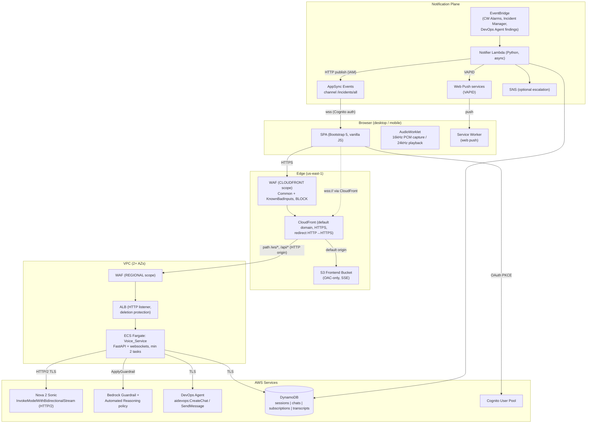
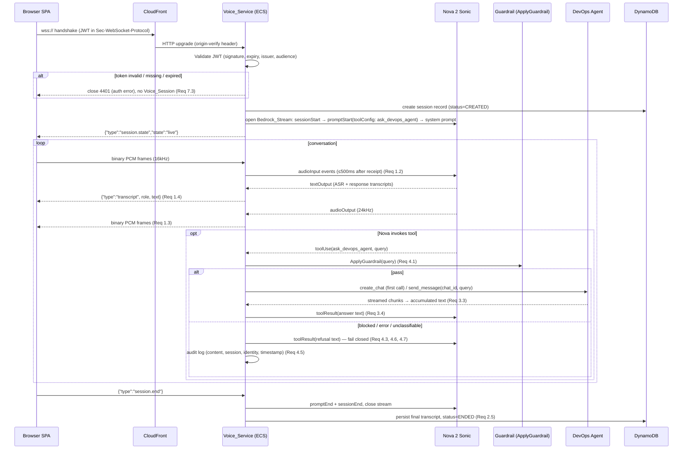
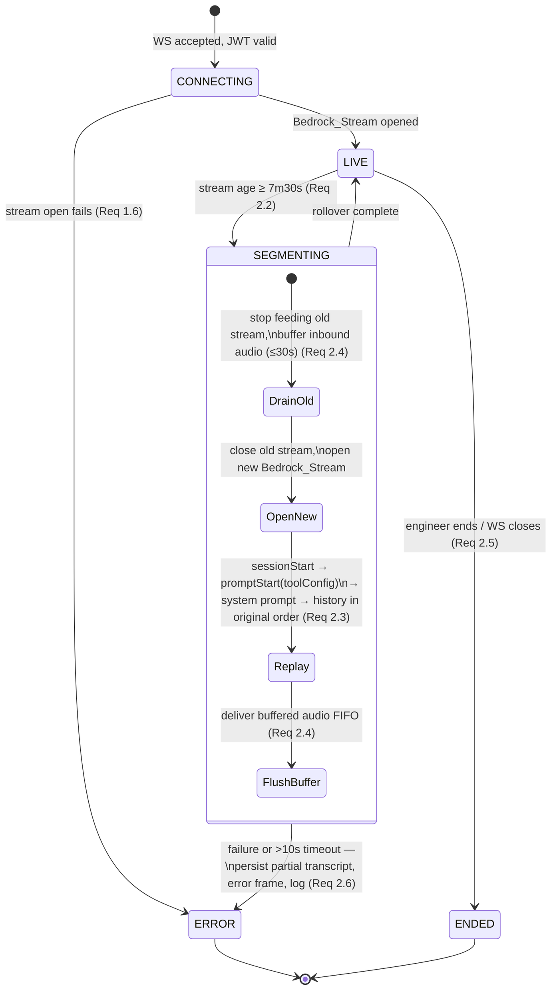

# Design Document: Nova Sonic Support Portal

## Overview

The Nova Sonic Support Portal is a voice-driven support portal for DevOps engineers. An engineer speaks into a browser application; Amazon Nova 2 Sonic (Bedrock speech-to-speech, us-east-1) transcribes and converses, forwarding engineer requests as text to the AWS DevOps Agent through a Nova Sonic tool named `ask_devops_agent`. The DevOps Agent's answer is spoken back. The portal also pushes incident notifications to engineers as in-app popups with an audio chime and as web push notifications when the browser is closed.

The system is built from two planes plus shared services:

- **Voice plane**: Browser (mic, 16 kHz PCM) ↔ WebSocket ↔ CloudFront ↔ ALB ↔ ECS Fargate (Python FastAPI + websockets, fully async). Each task holds Bedrock `InvokeModelWithBidirectionalStream` sessions to Nova 2 Sonic and manages the 8-minute Bedrock stream cap through session segmentation with context replay. *(Req 1, 2, 3, 4, 10)*
- **Notification plane**: EventBridge (CloudWatch Alarms, Incident Manager, DevOps Agent findings) → Notifier Lambda → AppSync Events broadcast channel (in-app popup + chime) and Web Push via a service worker (browser closed), plus optional SNS escalation. *(Req 5, 6)*
- **Shared services**: Cognito (mandatory auth), DynamoDB (session state, chat/execution mappings, push subscriptions, transcripts), CloudFront + S3 (frontend), WAF, Secrets Manager / SSM Parameter Store. *(Req 7, 8, 9, 11, 12, 13, 14)*

Everything is provisioned with Terraform in two layers (`infrastructure/bootstrap`, `infrastructure/app`) with separate state, released through three CI/CD pipelines (frontend, backend, iac), each gated by a security scan, unit tests, build+plan, and a manual approval. *(Req 15, 16)*

Design elements are annotated with the requirements they satisfy: *(Req X.Y)*. A full traceability matrix is at the end of this document.

### Key Research Findings and Technical Decisions

These findings from AWS documentation drive non-obvious parts of the design:

1. **Nova Sonic bidirectional event protocol.** Sessions follow a strict event grammar: `sessionStart` (inference config) → `promptStart` (prompt name, audio output config, **tool configuration**) → content blocks (`contentStart` / `audioInput` or `textInput` / `contentEnd`). The model emits `completionStart`, ASR/text `textOutput`, `audioOutput`, `toolUse`, and `contentEnd` events. Tool results are returned into the same stream as `contentStart(type=TOOL, toolUseId)` → `toolResult` (stringified JSON) → `contentEnd`. Source: [Nova 2 Sonic input events](https://docs.aws.amazon.com/nova/latest/nova2-userguide/sonic-input-events.html), [output events](https://docs.aws.amazon.com/nova/latest/nova2-userguide/sonic-output-events.html). This grammar defines the segmentation replay sequence in this design. *(Req 2.3, 3.1)*
2. **Automated Reasoning checks are detect-mode.** Per [AWS documentation](https://docs.aws.amazon.com/bedrock/latest/userguide/integrate-automated-reasoning-checks.html), Automated Reasoning checks "return findings and feedback rather than blocking content" — the application decides. Therefore the **fail-closed enforcement point is the Voice_Service**: it calls the standalone [`ApplyGuardrail` API](https://docs.aws.amazon.com/bedrock/latest/APIReference/API_runtime_ApplyGuardrail.html) on every tool input and forwards to the DevOps Agent only on an explicit pass. Any intervention, non-VALID finding, evaluation error, or unavailability results in a block. *(Req 4.1, 4.6, 4.7)*
3. **CodeCommit is closed to new customers** (since July 2024). The Bootstrap_Layer must create source repositories that pipelines consume without manually created resources *(Req 15.2)*. Options considered: CodeConnections (requires a manual console handshake and an external Git host account — violates the no-manual-resources constraint), CodeCatalyst (separate service onboarding), **versioned S3 source buckets (chosen)** — fully Terraform-provisionable, auto-trigger via EventBridge on object upload, no external dependencies. Developers push with a small `push-source.sh` helper (`git archive` → `aws s3 cp`), which is the "commit push" trigger event for pipelines. *(Req 15.2, 16.1, 16.2)*
4. **DevOps Agent SDK**: available in boto3 as client `devops-agent` with `create_chat` and `send_message` (streaming response) operations; IAM actions are namespaced `aidevops:CreateChat` / `aidevops:SendMessage`. *(Req 3.2, 3.3)*
5. **ECS task scale-in protection** is set from inside the task via `PUT $ECS_AGENT_URI/task-protection/v1/state` (or the `ecs:UpdateTaskProtection` API), with an optional expiry that must be refreshed for long sessions. *(Req 10.3, 10.4)*
6. **AppSync Events** supports Cognito user pool auth for browser subscriptions over its realtime WebSocket endpoint, and an HTTP `POST /event` publish API (IAM/SigV4) usable directly from Lambda. *(Req 5.1, 7.4)*
7. **Mixed-content constraint**: a page served over HTTPS cannot open an insecure `ws://` connection. Since no custom-domain certificate is available for the ALB *(Req 12.4)*, the voice WebSocket rides through the **CloudFront distribution (wss:// on the default domain)** to the ALB over an HTTP origin. Cognito JWT validation at the WebSocket handshake protects the CloudFront→ALB hop *(Req 12.5)*, and a CloudFront-injected origin-verification header prevents direct ALB access. <!-- nosemgrep: javascript.lang.security.detect-insecure-websocket.detect-insecure-websocket -- design prose describing the mixed-content constraint, not code -->

## Architecture

### High-Level Architecture



*(Req 1.1, 5.1, 7.1, 9.1, 10.1, 11.1, 12.1)*

### Voice Plane: Session Lifecycle



### Session Segmentation State Machine

A Voice_Session spans multiple consecutive Bedrock_Streams. A per-stream timer triggers segmentation at 7 m 30 s of elapsed stream time, safely before Bedrock's 8-minute hard cap. *(Req 2.2)*



Segmentation invariants:

- The replay sequence into the new stream is exactly: `sessionStart` → `promptStart` (same tool configuration) → system-prompt text block → conversation history as alternating USER/ASSISTANT text blocks **in original chronological order** → then buffered audio in arrival order. *(Req 2.3, 2.4)*
- The audio buffer is bounded at 30 seconds of audio (960 KB at 16 kHz × 16-bit mono); if the bound is reached, the oldest unbuffered state is preserved by dropping the newest frames and noting the drop in logs — engineers hear a brief "please hold" tone via a status frame so speech during rollover is not silently lost.
- A watchdog fails segmentation if the new stream is not live within 10 seconds: partial transcript is persisted, a structured `segmentation_failed` error frame is sent, and the failure is logged with the Voice_Session id. *(Req 2.6)*

### Notification Plane

```mermaid
sequenceDiagram
    participant SRC as CW Alarms / Incident Mgr / DevOps Agent findings
    participant EB as EventBridge
    participant NL as Notifier Lambda
    participant ASE as AppSync Events
    participant B as Browser SPA (open)
    participant SW as Service Worker (browser closed)
    participant SNS as SNS (optional)

    SRC->>EB: incident event
    EB->>NL: rule match (3 source patterns)
    NL->>NL: normalize → Incident_Notification{summary, severity, timestamp, executionId?} (Req 5.5, 5.6)
    par in-app
        NL->>ASE: POST /event channel=/incidents/all (retry ≤3, then log exhaustion) (Req 5.1, 5.9, 5.10)
        ASE-->>B: event over wss (Cognito-authorized) (Req 7.4)
        B->>B: popup (summary, severity, timestamp) + chime;<br/>popup shown even if audio blocked (Req 5.2–5.4)
    and web push
        NL->>NL: read all Web_Push_Subscriptions (DynamoDB)
        NL->>SW: Web Push (VAPID); 404/410 → delete subscription;<br/>other failures retry ≤3 then discard (Req 6.2, 6.5, 6.8)
        SW->>SW: show system notification (summary) (Req 6.3)
    and escalation
        NL->>SNS: publish when configured (Req 5.11)
    end
    B->>B: click popup → open Voice_Session scoped to executionId,<br/>or with summary/severity context if absent (Req 5.7, 5.8)
    SW->>B: click system notification → open Portal, verify auth,<br/>start scoped Voice_Session (Req 6.4)
```

### CI/CD and Two-Layer Terraform

```mermaid
graph LR
    subgraph Bootstrap["infrastructure/bootstrap (state: bootstrap/terraform.tfstate)"]
        SB["3 versioned S3 source buckets<br/>(frontend / backend / iac)"]
        ECR["ECR repo (backend image)"]
        ART["Artifact bucket + CI/CD IAM roles"]
        ST["App-layer TF state bucket + lock table"]
    end

    subgraph Pipelines["3 × CodePipeline (V2), auto-trigger via EventBridge on source upload"]
        direction LR
        P1["Source (S3)"] --> P2["SecurityScan<br/>(CodeBuild)"] --> P3["UnitTest<br/>(CodeBuild)"] --> P4["Build+Plan<br/>(CodeBuild)"] --> P5["Manual Approval<br/>(7-day timeout)"] --> P6["Deploy<br/>(CodeBuild)"]
    end

    subgraph App["infrastructure/app (state: app/terraform.tfstate)"]
        APP["VPC, ALB, ECS, Cognito, DynamoDB,<br/>AppSync Events, Guardrail, WAF,<br/>CloudFront+S3, EventBridge, Lambda,<br/>CloudWatch alarms, SNS"]
    end

    Bootstrap --> Pipelines
    Pipelines -->|"iac pipeline: terraform apply"| App
    Pipelines -->|"backend pipeline: image → ECR → ECS deploy"| APP
    Pipelines -->|"frontend pipeline: aws s3 sync + CF invalidation"| APP
```



Pipeline stage gating: each stage starts only after the previous succeeds; a failing stage stops and fails the execution with no subsequent stage running *(Req 16.3, 16.5)*. The manual approval stage relies on CodePipeline's built-in 7-day approval timeout, after which the execution fails *(Req 16.6–16.8)*. The frontend deploy stage runs `aws s3 sync` inside CodeBuild followed by a CloudFront invalidation; the CodePipeline S3 deploy action is not used anywhere in the pipeline definition *(Req 16.9, 16.10)*.

Deployment order (documented step-by-step in README.md *(Req 18.2, 18.5)*):

1. `infrastructure/bootstrap`: operator runs `terraform init/apply` locally (creates pipelines, source buckets, ECR, app-layer state backend).
2. Push `infrastructure/` source → IaC_Pipeline applies `infrastructure/app` (all runtime infrastructure).
3. Push `backend/` source → Backend_Pipeline builds/pushes the image and deploys the ECS service.
4. Push `frontend/` source → Frontend_Pipeline builds, syncs to S3, invalidates CloudFront.

## Components and Interfaces

### Backend: Voice_Service (ECS Fargate)

Python 3.14, FastAPI + uvicorn, `websockets`-based WS endpoint, fully async (`async`/`await` for all I/O; no blocking calls on the event loop — blocking SDK surfaces are isolated behind adapters using `aioboto3`/`httpx` or `asyncio.to_thread`) *(Req 17.2, 17.3)*.

Modules follow SOLID: pure domain logic depends only on **port interfaces** (abstract base classes); AWS SDKs appear only in adapter modules *(Req 17.6)*. This isolation is what makes the correctness properties testable with fakes.

```
backend/
├── voice_service/
│   ├── app/
│   │   ├── main.py                  # FastAPI app factory, /ws/voice, /healthz, signal handlers
│   │   ├── config.py                # Settings loader: env + SSM/Secrets Manager; validates at startup (Req 14.4)
│   │   ├── exceptions.py            # Exception hierarchy (see Error Handling)
│   │   ├── logging.py               # Structured JSON logs: timestamp, severity, session_id (Req 19.4)
│   │   ├── auth/
│   │   │   └── jwt_validator.py     # Cognito JWKS validation at WS handshake (Req 7.2, 7.3, 7.6)
│   │   ├── domain/                  # pure logic — no I/O, fully unit/property testable
│   │   │   ├── session.py           # Voice_Session state machine (CONNECTING/LIVE/SEGMENTING/ENDED/ERROR)
│   │   │   ├── segmentation.py      # rollover scheduling (7m30s), replay-sequence builder (Req 2.2, 2.3)
│   │   │   ├── audio_buffer.py      # bounded FIFO buffer, 30s cap (Req 2.4)
│   │   │   ├── transcript.py        # transcript accumulation, chunk concatenation (Req 3.3)
│   │   │   ├── guardrail_policy.py  # fail-closed decision function (Req 4.4, 4.6, 4.7)
│   │   │   └── ttl.py               # TTL computation: last_update + retention (Req 8.4)
│   │   ├── ports/                   # abstract interfaces (ABCs)
│   │   │   ├── bedrock_stream.py    # BedrockStreamPort: open/send_event/receive/close
│   │   │   ├── devops_agent.py      # DevOpsAgentPort: create_chat, send_message (async iterator)
│   │   │   ├── guardrail.py         # GuardrailPort: evaluate(text) -> GuardrailResult
│   │   │   ├── session_store.py     # SessionStorePort: sessions, chats, transcripts, subscriptions
│   │   │   └── task_protection.py   # TaskProtectionPort: acquire/release
│   │   ├── adapters/                # AWS implementations (only place SDKs are imported) (Req 17.6)
│   │   │   ├── bedrock_stream_client.py   # InvokeModelWithBidirectionalStream, HTTP/2, us-east-1 (Req 2.1)
│   │   │   ├── devops_agent_client.py     # boto3 'devops-agent' via aioboto3/to_thread, 60s budget (Req 3.8)
│   │   │   ├── guardrail_client.py        # bedrock-runtime ApplyGuardrail (Req 4.1)
│   │   │   ├── dynamodb_store.py          # aioboto3 DynamoDB, conditional single-item writes (Req 8.5)
│   │   │   └── ecs_task_protection.py     # PUT $ECS_AGENT_URI/task-protection/v1/state (Req 10.3)
│   │   ├── orchestration/
│   │   │   ├── voice_session_manager.py   # wires WS ↔ stream ↔ tools; per-session task group
│   │   │   ├── tool_router.py             # toolUse dispatch → guardrail gate → agent (Req 3.x, 4.x)
│   │   │   └── drain_manager.py           # SIGTERM: stop new WS, ≤120s drain, notify clients (Req 10.5, 10.8)
│   │   └── protocol/
│   │       └── ws_messages.py       # WS frame schemas (see Data Models) + (de)serialization
│   ├── tests/                       # pytest + pytest-asyncio + hypothesis
│   ├── Dockerfile
│   └── pyproject.toml               # ruff (D, ASYNC, BLE, TRY rules), mypy — build fails on violation (Req 17.7)
├── notifier/
│   ├── src/
│   │   ├── handler.py               # Lambda entrypoint (asyncio.run)
│   │   ├── normalizer.py            # source event → Incident_Notification (pure) (Req 5.5, 5.6)
│   │   ├── channels/
│   │   │   ├── appsync_publisher.py # SigV4 POST /event, retry ≤3 (Req 5.1, 5.9, 5.10)
│   │   │   ├── webpush_sender.py    # pywebpush + VAPID; 404/410 cleanup; retry ≤3 (Req 6.2, 6.5, 6.8)
│   │   │   └── sns_publisher.py     # optional escalation (Req 5.11)
│   │   └── subscription_repo.py     # DynamoDB push_subscriptions access
│   └── tests/
└── shared/
    ├── retry.py                     # generic bounded async retry with exhaustion logging (Req 2.7, 5.9, 6.8, 10.7)
    ├── exceptions.py                # PortalError base hierarchy
    └── logging.py                   # shared structured-logging setup
```

Key component behaviors:

- **voice_session_manager**: one asyncio task group per WebSocket connection — inbound pump (WS → Bedrock), outbound pump (Bedrock → WS), segmentation timer, token-expiry watchdog *(Req 7.6)*, transcript persister. Sends state frames on every transition *(Req 9.4, 9.5)*.
- **tool_router**: on `toolUse(ask_devops_agent)`: guardrail gate → chat lookup/create in Session_Store (create once per session, reuse thereafter; recreate + persist if the mapping is missing) *(Req 3.2, 3.9, 3.10)* → `send_message` with a 60-second budget enforced by `asyncio.timeout`; chunks accumulated in arrival order into one text; result returned as `toolResult` *(Req 3.3, 3.4, 3.8)*. Sessions opened from an incident scope `create_chat` to the executionId *(Req 3.5, 3.6)*.
- **task protection manager** (inside `ecs_task_protection` + session registry): protection acquired when the live-session count goes 0→1 and released within 60 s of the count reaching 0; the protection expiry is refreshed on a rolling basis for long sessions. On protection failure after 3 retries the task flips `/healthz` to 503 so the ALB stops routing new connections while existing sessions continue *(Req 10.3, 10.4, 10.7, 19.6, 19.7)*.
- **drain_manager**: on SIGTERM, reject new WebSocket upgrades and mark `/healthz` 503; existing sessions continue for up to the ECS `stopTimeout` (120 s); any session still active at expiry receives `{"type":"session.terminating"}` before close *(Req 10.5, 10.8)*.
- **config.py**: loads configuration from environment variables (non-sensitive) and SSM/Secrets Manager (sensitive) at startup; any missing required key raises `ConfigurationError` naming the key and aborts startup before the server binds *(Req 14.1, 14.4, 14.5)*. Secret values are wrapped in a `Secret` type whose `__repr__`/`__str__` yields `Secret(<key>)`, keeping values out of logs *(Req 14.6)*.

### Frontend (SPA)

Vanilla ES modules + Bootstrap 5 (responsive 320–1920 px, no horizontal scrolling) *(Req 9.2)*. Served from S3 via CloudFront. Environment-specific values (Cognito pool/client ids, CloudFront wss URL, AppSync Events endpoints, VAPID public key) are loaded at runtime from `config.json`, generated by the frontend pipeline from Terraform outputs — the built artifact is environment-independent *(Req 14.3)*.

```
frontend/
├── public/
│   ├── index.html
│   ├── sw.js                    # service worker: push display + notificationclick (Req 6.3, 6.4)
│   └── config.json              # generated at deploy time (not in source)
├── src/
│   ├── main.js                  # bootstrapping, route guard → Cognito redirect (Req 7.1, 7.7)
│   ├── auth/cognito.js          # OAuth 2.0 code + PKCE against Cognito Hosted UI; token refresh
│   ├── audio/
│   │   ├── capture.js           # getUserMedia + AudioWorklet: Float32 → 16kHz Int16 PCM (Req 1.1)
│   │   ├── pcm-worklet.js       # downsampling worklet processor
│   │   └── playback.js          # 24kHz PCM playback queue via AudioContext (Req 1.7)
│   ├── ws/voice-client.js       # WS protocol client, reconnect banner + button (Req 1.5)
│   ├── events/appsync-client.js # AppSync Events realtime subscription (Cognito auth) (Req 5.2, 7.4)
│   ├── push/push-manager.js     # permission flow, subscription register/persist + retry (Req 6.1, 6.6, 6.7)
│   ├── ui/
│   │   ├── transcript.js        # role-distinguished transcript rendering (Req 1.4)
│   │   ├── status.js            # connecting|live|segmenting|ended|error badge (Req 9.4, 9.5)
│   │   ├── incident-popup.js    # popup + chime; chime failure tolerated (Req 5.2–5.4)
│   │   └── errors.js            # mic-denied, unsupported-browser, auth-expired messaging (Req 1.8, 9.6, 9.7)
│   └── capability.js            # feature detection: getUserMedia, AudioWorklet, WS (Req 9.7)
├── tests/                       # vitest + fast-check (jsdom)
└── package.json
```

Browser support gate: on load, `capability.js` verifies `navigator.mediaDevices.getUserMedia`, `AudioWorklet`, `WebSocket`, and (for push) `serviceWorker`/`PushManager`; unsupported browsers get a clear error instead of a broken session *(Req 9.7)*. Microphone denial shows an explanatory error and never opens the WebSocket *(Req 1.8, 9.6)*.

### Terraform Structure

```
infrastructure/
├── bootstrap/                     # layer 1 — separate state (Req 15.6)
│   ├── main.tf  variables.tf  outputs.tf
│   └── modules/
│       ├── source_buckets/        # 3 versioned S3 source buckets + EventBridge triggers (Req 16.1, 16.2)
│       ├── pipeline/              # reusable: Source→Scan→Test→Build+Plan→Approval→Deploy (Req 16.3–16.8)
│       ├── codebuild/             # per-stage projects, buildspecs from repo
│       ├── ecr/                   # backend image repo (scan-on-push, SSE) (Req 12.3)
│       └── state_backend/         # app-layer TF state bucket + DynamoDB lock table
└── app/                           # layer 2 — separate state, applied by IaC_Pipeline
    ├── main.tf  variables.tf  outputs.tf   # vars: environment, access_logging_bucket_name (validated non-empty), thresholds (Req 13.4, 13.6, 15.5, 15.7)
    └── modules/
        ├── network/               # VPC, 2+ AZ public/private subnets, NAT
        ├── alb/                   # HTTP listener, deletion protection, access logs → provided bucket (Req 12.4, 13.1, 13.5)
        ├── ecs_service/           # cluster, task def, autoscaling (ALB ActiveConnectionCount step policies),
        │                          # min 2 tasks / 2 AZs, stopTimeout=120 (Req 10.1, 10.2, 10.6)
        ├── iam/                   # task role (bedrock:InvokeModelWithBidirectionalStream, bedrock:ApplyGuardrail,
        │                          # aidevops:*, dynamodb, ecs:UpdateTaskProtection), execution role (Req 15.3)
        ├── cognito/               # user pool, SPA client (PKCE), hosted UI domain (Req 7.1)
        ├── dynamodb/              # 4 tables, TTL enabled, SSE, PITR (Req 8.1, 8.4, 12.3)
        ├── appsync_events/        # Events API: Cognito connect/subscribe auth, IAM publish auth (Req 7.4)
        ├── bedrock_guardrail/     # aws_bedrock_guardrail + Automated Reasoning policy attachment (Req 4.1)
        ├── cloudfront_s3/         # frontend bucket (OAC-only policy), dual origin (S3 + ALB /ws/*),
        │                          # redirect-http-to-https, origin-verify header (Req 9.1, 12.1, 12.2, 13.7)
        ├── waf/                   # 2 web ACLs (CLOUDFRONT + REGIONAL), managed rule sets in BLOCK,
        │                          # logging to CloudWatch Logs (Req 11.1–11.3, 11.6)
        ├── s3_policies/           # deny non-TLS (aws:SecureTransport=false) + TLS<1.2 on all buckets (Req 13.2, 13.3)
        ├── notifications/         # EventBridge rules (3 sources), notifier Lambda, SNS escalation topic (Req 5.1, 5.11)
        └── observability/        # CloudWatch alarms (task count, unhealthy targets, error rate,
                                   # notifier failures) → ops SNS topic (Req 19.2, 19.3)
```

All environment-specific values (environment name, account inputs, `access_logging_bucket_name`, scaling thresholds, retention period) are input variables — never hardcoded *(Req 15.5)*; `access_logging_bucket_name` uses a `validation` block rejecting empty values so `terraform validate`/`plan` fails with a clear message *(Req 13.6, 15.7)*. The logging bucket itself is **referenced, never created** *(Req 13.5)*.

### Repository Deliverables

Top-level layout is exactly `infrastructure/`, `frontend/`, `backend/` *(Req 18.1)*, plus:

- `README.md`: architecture overview, prerequisites (AWS account with Bedrock Nova 2 Sonic + Guardrails AR access, Terraform ≥1.9, AWS CLI, Docker, Node 24, Python 3.14), and step-by-step deployment (bootstrap → iac → backend → frontend) with the command and observable success outcome for each step *(Req 18.2, 18.5)*.
- `.kiro/steering/infrastructure.md`, `frontend.md`, `backend.md`: conventions and coding standards per code area *(Req 18.3)*.
- `.kiro/hooks/lint-on-save.json`, `test-on-save.json`: lint and test execution on file save *(Req 18.4)*.

## Data Models

### DynamoDB Tables (Session_Store)

All tables: on-demand capacity, SSE enabled, point-in-time recovery. TTL attribute `ttl` (epoch seconds) enabled where noted. *(Req 8.1, 12.3)*

**`{env}-voice-sessions`** — Voice_Session state *(Req 8.1, 8.2)*

| Attribute | Type | Notes |
|---|---|---|
| `session_id` (PK) | S | UUIDv4 |
| `engineer_id` | S | Cognito `sub` |
| `status` | S | `CREATED\|LIVE\|SEGMENTING\|ENDED\|ERROR` |
| `execution_id` | S? | present when opened from an incident *(Req 3.5)* |
| `incident_context` | M? | summary/severity when no executionId *(Req 5.8)* |
| `segment_count` | N | Bedrock_Streams used so far |
| `created_at` / `updated_at` | S | ISO-8601 UTC |
| `ttl` | N | `updated_at + retention` (default 30 days) *(Req 8.4)* |

GSI `by-engineer`: PK `engineer_id`, SK `created_at` (reconnect lookup).

**`{env}-agent-chats`** — DevOps_Agent chat/execution mapping *(Req 3.2, 8.1)*

| Attribute | Type | Notes |
|---|---|---|
| `session_id` (PK) | S | one chat per Voice_Session |
| `chat_id` | S | from `aidevops:CreateChat` |
| `execution_id` | S? | scoping, when present |
| `created_at` / `updated_at` | S | |
| `ttl` | N | aligned with the owning session |

**`{env}-push-subscriptions`** — Web_Push_Subscriptions *(Req 6.1, 8.1, 8.7)*

| Attribute | Type | Notes |
|---|---|---|
| `engineer_id` (PK) | S | Cognito `sub` |
| `endpoint_hash` (SK) | S | SHA-256 of the push endpoint URL |
| `subscription` | M | `{endpoint, keys:{p256dh, auth}}` |
| `created_at` / `updated_at` | S | |

No TTL — removed explicitly on unsubscribe or on push-service rejection (404/410) *(Req 6.5)*. Notifier fan-out reads the full table (bounded population: engineers on call).

**`{env}-transcripts`** — conversation transcripts *(Req 2.5, 8.1, 8.3)*

| Attribute | Type | Notes |
|---|---|---|
| `session_id` (PK) | S | |
| `seq` (SK) | N | monotonically increasing per session |
| `role` | S | `USER\|ASSISTANT` |
| `text` | S | utterance / response text |
| `timestamp` | S | ISO-8601 UTC |
| `ttl` | N | `updated_at + retention` (default 30 days) *(Req 8.4)* |

Write discipline: every state mutation is a single-item conditional write (or a `TransactWriteItems` where two items must move together, e.g. session status + chat mapping), so a failure leaves no partially updated record *(Req 8.5)*. Session state changes complete their DynamoDB write **before** the state change is reported to the client *(Req 8.2, 8.7)*.

### WebSocket Protocol (Frontend ↔ Voice_Service)

Endpoint: `wss://{cloudfront-domain}/ws/voice`. Authentication: the Cognito access token travels in the `Sec-WebSocket-Protocol` header as subprotocol pair `("bearer", "<jwt>")` — browsers cannot set custom WS headers, and this keeps tokens out of URLs and access logs. The server validates before `accept()` *(Req 7.2, 7.3)*.

Binary frames (both directions) carry raw PCM audio: client→server 16 kHz / 16-bit / mono *(Req 1.1)*; server→client 24 kHz / 16-bit / mono (Nova Sonic output format). Text frames carry JSON control messages:

Client → Server:

```json
{"type": "session.start", "executionId": "exec-123 | null", "incidentContext": {"summary": "...", "severity": "..."} , "resumeSessionId": "uuid | null"}
{"type": "session.end"}
```

Server → Client:

```json
{"type": "session.state", "sessionId": "uuid", "state": "connecting|live|segmenting|ended|error"}
{"type": "transcript", "role": "user|assistant", "text": "...", "timestamp": "ISO-8601"}
{"type": "error", "category": "auth_invalid|auth_expired|bedrock_unavailable|segmentation_failed|session_not_found|internal", "message": "...", "recoverable": false}
{"type": "session.terminating", "reason": "drain_timeout"}
```

- `session.state` drives the status badge (5 states) *(Req 9.4, 9.5)*.
- `error` with `category=bedrock_unavailable` precedes WS close when a Bedrock_Stream cannot be opened *(Req 1.6)*; `auth_expired` precedes close on mid-session token expiry *(Req 7.6)*; `session_not_found` answers a `resumeSessionId` that is missing or expired *(Req 8.6)*.
- `session.terminating` is sent to sessions still active when the drain period expires *(Req 10.8)*.
- On reconnect with `resumeSessionId`, the service restores session state and transcript history from the Session_Store and replays it into a fresh Bedrock_Stream (same mechanism as segmentation replay) *(Req 8.3)*.

### Nova Sonic Event Flow (Voice_Service ↔ Bedrock)

Per-stream input grammar *(Req 2.1)*:

1. `sessionStart` — inference configuration.
2. `promptStart` — `promptName`, audio output configuration (24 kHz speech), `toolConfiguration` containing the `ask_devops_agent` tool spec *(Req 3.1)*:

```json
{
  "toolSpec": {
    "name": "ask_devops_agent",
    "description": "Forward a DevOps diagnostic question to the AWS DevOps Agent and return its answer.",
    "inputSchema": {"json": "{\"type\":\"object\",\"properties\":{\"query\":{\"type\":\"string\",\"description\":\"The engineer's request, as text\"}},\"required\":[\"query\"]}"}
  }
}
```

3. System-prompt text block: `contentStart(TEXT, SYSTEM)` → `textInput` → `contentEnd`. The system prompt establishes the read-only diagnostic persona and, for incident-scoped sessions, injects the incident summary/severity *(Req 5.8)*.
4. (Segmentation/reconnect replay only) conversation history as `contentStart(TEXT, USER|ASSISTANT)` blocks in original order *(Req 2.3, 8.3)*.
5. Audio: `contentStart(AUDIO, USER, interactive)` → repeated `audioInput` (base64 LPCM 16 kHz) → `contentEnd`.

Output events consumed: `completionStart`; `textOutput` for ASR (user) and assistant transcripts → relayed as `transcript` frames and appended to the transcript accumulator *(Req 1.4, 2.5)*; `audioOutput` (base64 24 kHz PCM) → relayed as binary frames *(Req 1.3)*; `toolUse` (toolUseId, toolName, input JSON) → tool_router; `contentEnd`/`completionEnd`.

Tool result return: `contentStart(TOOL, toolUseId)` → `toolResult` (stringified JSON: `{"answer": "..."}` or `{"error": "..."}`) → `contentEnd` *(Req 3.4, 3.7)*. Stream teardown: `promptEnd` → `sessionEnd` → close *(Req 2.5)*.

### Guardrail Evaluation Model

`GuardrailPort.evaluate(text) -> GuardrailResult` where `GuardrailResult = {outcome: PASS | BLOCK, reason: str}`. The adapter calls `bedrock-runtime ApplyGuardrail` (guardrail id/version from config, `source=INPUT`) against the guardrail that carries the Automated Reasoning policy (read-only-operations policy: any request to create, modify, delete, or terminate AWS resources or IAM entities is non-compliant) *(Req 4.1, 4.2)*.

The pure decision function `guardrail_policy.decide(response | error) -> Decision` is **fail-closed** *(Req 4.4, 4.6, 4.7)*:

| Input | Decision |
|---|---|
| `action == "NONE"` and all Automated Reasoning findings VALID/compliant | PASS |
| `action == "GUARDRAIL_INTERVENED"` | BLOCK |
| any AR finding of INVALID / SATISFIABLE / IMPOSSIBLE / TRANSLATION_AMBIGUOUS / NO_TRANSLATION (not classifiable as read-only) | BLOCK |
| SDK exception, timeout, throttle, or malformed response | BLOCK |

On BLOCK: the tool result text tells Nova Sonic to inform the engineer the operation is not permitted and only read/diagnostic operations are supported *(Req 4.3)*; an audit log entry records `{blocked_content, session_id, engineer_id, timestamp}` *(Req 4.5)*.

### Incident_Notification Payload Schema

Produced by `normalizer.py` from the three EventBridge source shapes; identical payload for AppSync Events, Web Push, and SNS *(Req 5.5, 5.6)*:

```json
{
  "notificationId": "uuid",
  "source": "cloudwatch-alarm | incident-manager | devops-agent-finding",
  "summary": "string (required)",
  "severity": "critical | high | medium | low (required)",
  "timestamp": "ISO-8601 UTC (required)",
  "executionId": "string (present iff provided by the source event)",
  "detail": {"...": "source-specific extras, optional"}
}
```

Field mapping: CloudWatch Alarm → `summary` = alarm name + new state reason, `severity` from alarm tag/configuration mapping; Incident Manager → incident title/impact; DevOps Agent finding → finding summary and `executionId` from the event detail *(Req 5.6)*. The frontend popup and the service-worker notification render `summary`, `severity`, `timestamp` and, on click, start a Voice_Session scoped by `executionId` or carrying `summary`/`severity` as context *(Req 5.2, 5.7, 5.8, 6.3, 6.4)*.

### Configuration Model

| Source | Contents |
|---|---|
| Environment variables (ECS task def / Lambda env) | non-sensitive: region, table names, guardrail id+version, AppSync endpoints, thresholds, retention days *(Req 14.1)* |
| SSM Parameter Store (SecureString) / Secrets Manager | sensitive: VAPID private key, origin-verify header secret *(Req 14.1)* |
| Terraform input variables | environment name, account inputs, `access_logging_bucket_name` *(Req 14.3, 15.5)* |
| `frontend/config.json` (generated at deploy) | Cognito ids, wss URL, Events endpoints, VAPID public key *(Req 14.3)* |

Startup validation: required-key manifest checked before serving; missing key → `ConfigurationError("missing configuration key: <name>")`, process exits non-zero *(Req 14.4)*; failed secret retrieval → startup abort naming the secret key (never its value) *(Req 14.5, 14.6)*. Static scanning (gitleaks + reviewed deny-list grep) in the security-scan stage keeps hardcoded secrets/account ids/endpoints at zero occurrences *(Req 14.2)*.

## Correctness Properties

*A property is a characteristic or behavior that should hold true across all valid executions of a system — essentially, a formal statement about what the system should do. Properties serve as the bridge between human-readable specifications and machine-verifiable correctness guarantees.*

Properties below target the pure domain logic (isolated behind ports, so all are testable with fakes — no AWS calls). Infrastructure-configuration criteria (WAF, TLS policies, pipeline wiring, table existence) are intentionally **not** properties; they are covered by Terraform plan assertions and integration/smoke tests in the Testing Strategy.

### Property 1: PCM conversion preserves audio structure

*For any* Float32 audio input buffer at a supported browser sample rate, the capture conversion SHALL produce 16-bit integer PCM at 16 kHz where every sample lies within the Int16 range, the output length equals the input length scaled by the resampling ratio (±1 frame), and silence maps to silence.

**Validates: Requirements 1.1**

### Property 2: Segmentation replay reconstructs context in order

*For any* conversation history (any lengths, roles, and unicode texts), the replay-sequence builder SHALL emit exactly `sessionStart`, then `promptStart` whose tool configuration contains the `ask_devops_agent` tool, then the system-prompt block, then the history as text blocks whose role/text sequence equals the original history in original chronological order, before any audio event.

**Validates: Requirements 2.3, 3.1**

### Property 3: Segmentation audio buffer is a bounded FIFO

*For any* sequence of audio frames received while segmentation is in progress, flushing the buffer SHALL deliver exactly the buffered frames, byte-identical and in arrival order, and the buffer SHALL never hold more than 30 seconds of audio (excess frames are dropped newest-first and counted, never reordered).

**Validates: Requirements 2.4**

### Property 4: Streamed chunk accumulation equals concatenation

*For any* sequence of streamed DevOps_Agent response chunks (including empty and unicode chunks), the accumulated tool result text SHALL equal the concatenation of all chunks in arrival order.

**Validates: Requirements 3.3**

### Property 5: Chat identifier is created once and reused

*For any* number n ≥ 1 of `ask_devops_agent` invocations within one Voice_Session (with a store that retains the mapping), the Voice_Service SHALL call `create_chat` exactly once and issue all n `send_message` calls with that same persisted chat identifier.

**Validates: Requirements 3.2, 3.9**

### Property 6: Execution scoping follows the session's origin

*For any* Voice_Session opened with an optional executionId, the DevOps_Agent chat SHALL be created with exactly that executionId when present and with no execution scoping when absent.

**Validates: Requirements 3.5, 3.6**

### Property 7: Guardrail gate is fail-closed

*For any* guardrail evaluation outcome — pass, intervention, any Automated Reasoning finding type (valid, invalid, satisfiable, impossible, ambiguous, untranslatable), SDK exception, timeout, or malformed response — the tool router SHALL forward the request to the DevOps_Agent if and only if the outcome is an explicit pass with no non-compliant finding; in every other case it SHALL return a refusal tool result (stating only read/diagnostic operations are supported) without any DevOps_Agent call, and SHALL emit an audit record containing the blocked content, Voice_Session identifier, engineer identity, and timestamp.

**Validates: Requirements 4.1, 4.2, 4.3, 4.4, 4.5, 4.6, 4.7**

### Property 8: Notification normalization is total and preserving

*For any* incident event from any of the three source shapes (CloudWatch Alarm, Incident Manager, DevOps Agent finding) with arbitrary field content, the normalizer SHALL produce an Incident_Notification containing a non-empty summary, a severity from the allowed set, a valid ISO-8601 timestamp, and an executionId if and only if the source event provided one.

**Validates: Requirements 5.5, 5.6**

### Property 9: Push fan-out is complete and self-cleaning

*For any* set of registered Web_Push_Subscriptions with any mix of delivery outcomes (success, expired/invalid rejection, transient failure), the Notifier SHALL attempt delivery of the payload (summary and executionId) to every subscription, SHALL remove exactly the subscriptions rejected as expired/invalid and no others, and SHALL never let one subscription's failure prevent attempts to the remaining subscriptions.

**Validates: Requirements 6.2, 6.5**

### Property 10: WebSocket authentication accepts only fully valid tokens

*For any* WebSocket handshake token — a validly signed unexpired Cognito JWT, or any mutation of one (altered signature, expired, wrong issuer, wrong audience, malformed, or absent) — the Voice_Service SHALL accept the connection and create a Voice_Session if and only if the token is fully valid, and on rejection SHALL create no session and process no audio.

**Validates: Requirements 7.2, 7.3, 12.5, 12.6**

### Property 11: State changes persist before they are confirmed

*For any* sequence of Voice_Session state transitions and Web_Push_Subscription registrations/removals, every Session_Store write SHALL complete before the corresponding state change or registration outcome is reported to the client.

**Validates: Requirements 8.2, 8.7**

### Property 12: Reconnect restores exactly what was persisted

*For any* persisted Voice_Session state and transcript entry list, disconnecting and reconnecting to that session SHALL restore session state and the complete transcript list, equal in content and order to what was persisted.

**Validates: Requirements 8.3**

### Property 13: TTL equals last update plus retention

*For any* record update time and any configured retention period (defaulting to 30 days when unconfigured), the computed TTL attribute SHALL equal the update time plus the retention period, expressed in epoch seconds.

**Validates: Requirements 8.4**

### Property 14: Bounded retry contract

*For any* operation failure pattern and retry limit of 3: if the operation succeeds on attempt k ≤ 4, the retry helper SHALL have made exactly k attempts and reported success; if all 4 attempts fail (initial + 3 retries), it SHALL have made exactly 4 attempts, reported failure, and logged retry exhaustion with the specific exception class.

**Validates: Requirements 2.7, 5.9, 5.10, 6.8, 10.7**

### Property 15: Startup configuration validation is complete

*For any* subset of required configuration keys removed from the environment, Voice_Service startup SHALL fail before serving with a `ConfigurationError` naming a missing key; with all required keys present, startup validation SHALL pass.

**Validates: Requirements 14.4**

### Property 16: Secret values never appear in output

*For any* secret value loaded through the `Secret` wrapper, the string rendering, repr, and any log or error message referencing the configuration entry SHALL contain the key name and SHALL NOT contain the secret value.

**Validates: Requirements 14.6**

### Property 17: Task protection tracks live sessions

*For any* interleaving of Voice_Session starts and ends on a task, scale-in protection SHALL be enabled whenever the live-session count is greater than zero, and SHALL be released (within the 60-second bound, under a fake clock) when the count returns to zero — so a task hosting live sessions is never scale-in eligible and an idle task always becomes eligible.

**Validates: Requirements 10.3, 10.4, 19.6, 19.7**

### Property 18: Rendering is complete and role-distinguished

*For any* transcript frame, the rendered transcript entry SHALL contain the text and carry the visual marker for its role (engineer vs. assistant); and *for any* Incident_Notification payload, the rendered popup SHALL contain the summary, severity, and timestamp.

**Validates: Requirements 1.4, 5.2**

### Property 19: Log entries carry required fields

*For any* log message, severity, and session context, the emitted structured log entry SHALL contain a timestamp and severity level, and SHALL contain the Voice_Session identifier whenever the entry was produced while handling a Voice_Session.

**Validates: Requirements 19.4**

### Property 20: Capability gate blocks unsupported browsers

*For any* subset of required browser capabilities (getUserMedia, AudioWorklet, WebSocket) reported as unavailable, the Frontend SHALL display the unsupported-browser error and refuse to start a Voice_Session; with all capabilities present, the session start path SHALL be allowed.

**Validates: Requirements 9.7**

## Error Handling

### Exception Hierarchy

All raised exceptions are specific subclasses of `PortalError`; bare `Exception` is never raised, and only top-level boundary handlers (WS connection handler, Lambda entrypoint, FastAPI exception middleware) may catch broadly to convert unhandled errors into error frames/responses — enforced by lint *(Req 17.4, 17.5)*.

```
PortalError
├── ConfigurationError            # missing/invalid config key (names the key) (Req 14.4, 14.5)
├── AuthenticationError
│   ├── TokenInvalidError         # bad signature/issuer/audience/malformed (Req 7.3)
│   └── TokenExpiredError         # expired at handshake or mid-session (Req 7.3, 7.6)
├── BedrockStreamError
│   ├── StreamOpenError           # cannot open Bedrock_Stream (Req 1.6)
│   └── SegmentationError         # rollover failure / 10s watchdog (Req 2.6)
├── DevOpsAgentError
│   ├── AgentRequestError         # CreateChat/SendMessage failure (Req 3.7)
│   └── AgentTimeoutError         # 60s stream budget exceeded (Req 3.8)
├── GuardrailUnavailableError     # evaluation error/timeout → treated as BLOCK (Req 4.6)
├── SessionStoreError             # DynamoDB read/write failure (Req 8.5)
├── NotificationPublishError      # AppSync publish failure (Req 5.9)
├── WebPushError
│   ├── SubscriptionGoneError     # 404/410 → delete subscription (Req 6.5)
│   └── PushDeliveryError         # transient delivery failure (Req 6.8)
└── TaskProtectionError           # protection acquire/release failure (Req 10.7)
```

### Error Propagation Map

| Failure | Handling | Client-visible outcome |
|---|---|---|
| Bedrock_Stream open fails | `StreamOpenError` → error frame `bedrock_unavailable`, close WS, end session, no further audio | error frame + close *(Req 1.6)* |
| Segmentation fails / >10 s | persist partial transcript, error frame `segmentation_failed`, log with session id | error frame *(Req 2.6)* |
| DevOps Agent call fails / times out | error tool result → Nova Sonic verbalizes; log exception class + session id | spoken error notice *(Req 3.7, 3.8)* |
| Guardrail intervened / error / unclassifiable | **fail closed**: BLOCK, refusal tool result, audit log | spoken "not permitted / read-only" *(Req 4.3, 4.6, 4.7)* |
| JWT missing/invalid/expired at handshake | reject before accept, close 4401, no session | connection refused *(Req 7.3)* |
| Token expires mid-session | error frame `auth_expired`, close, drop post-expiry audio | error frame + close *(Req 7.6)* |
| Session_Store read/write fails | `SessionStoreError`, bounded retry for transcripts, log with session id; conditional single-item writes leave no partial record | error indication to caller *(Req 2.7, 8.5)* |
| Reconnect to unknown/expired session | error frame `session_not_found`, reject | error frame *(Req 8.6)* |
| AppSync publish fails | retry ≤3 (jittered backoff), then log exhaustion; other channels unaffected | none (logged) *(Req 5.9, 5.10)* |
| Web push rejected 404/410 | delete subscription, stop deliveries | none *(Req 6.5)* |
| Web push transient failure | retry ≤3 then discard for that subscription | none *(Req 6.8)* |
| Task protection fails | retry ≤3; `/healthz` → 503 until confirmed (no new sessions routed) | none *(Req 10.7)* |
| Chime playback blocked | popup still shown, notification never suppressed | popup without sound *(Req 5.4)* |
| SIGTERM drain expiry with live session | `session.terminating` frame before close | notified close *(Req 10.8)* |

Retry policy: shared `retry.py` helper — up to 3 retries (4 attempts), exponential backoff with jitter (0.2 s / 0.8 s / 2 s), retries only on retryable error classes, logs each failure and a distinct exhaustion record with the specific exception class *(Property 14)*. Notifier channels (AppSync, Web Push, SNS) run concurrently and independently: one channel's failure never suppresses the others.

## Testing Strategy

### Property-Based Tests (backend: hypothesis, frontend: fast-check)

- Backend: `hypothesis` with `pytest`/`pytest-asyncio`; frontend: `fast-check` with `vitest`. Property-based testing libraries are used as-is — never hand-rolled.
- Every property test runs **at least 100 iterations** (`settings(max_examples=100)` / `fc.assert(..., {numRuns: 100})`).
- One property-based test per design property, tagged with a comment in the format:
  `# Feature: nova-sonic-support-portal, Property 7: Guardrail gate is fail-closed`
- All properties execute against in-memory fakes of the port interfaces (`FakeBedrockStream`, `FakeDevOpsAgent`, `FakeSessionStore`, `FakeTaskProtection`, `FakeClock`) — no AWS access, fast and deterministic.

### Unit Tests (examples and edge cases)

pytest + pytest-asyncio (backend), vitest + jsdom (frontend). Focused example tests for the branch-specific criteria identified in prework, e.g.: Bedrock open failure path *(1.6)*, segmentation watchdog *(2.6)*, first-call chat creation and missing-mapping recovery *(3.2, 3.10)*, agent failure/timeout tool results *(3.7, 3.8)*, chime-blocked popup *(5.3, 5.4)*, popup click scoping *(5.7, 5.8)*, push permission/persistence failures *(6.6, 6.7)*, mid-session token expiry *(7.6)*, drain flow with termination notice *(10.5, 10.8)*, segmentation boundary at 7 m 30 s *(2.2)*, status badge for all five states *(9.4)*, secret-retrieval startup failure *(14.5)*.

### Terraform Checks

- `terraform fmt -check`, `terraform validate` on both layers in the IaC unit-test stage.
- **Plan-JSON assertion tests** (pytest against `terraform show -json`): ALB deletion protection *(13.1)*; SecureTransport + TLS≥1.2 deny statements on every created bucket *(13.2, 13.3)*; no logging-bucket creation and correct reference *(13.5)*; OAC-only frontend bucket policy *(13.7)*; WAF ACLs with both managed rule sets in block mode and logging attached *(11.1–11.3, 11.6)*; DynamoDB tables/keys/TTL/SSE *(8.1, 8.4, 12.3)*; ECS min 2 tasks across 2 AZs, `stopTimeout=120` *(10.1)*; 4 CloudWatch alarms with metric/threshold/period wired to the ops SNS topic *(19.2, 19.3)*; three pipelines with Scan→Test→Build+Plan→Approval→Deploy order, no S3 deploy action *(16.1, 16.3, 16.6, 16.10)*.
- Negative tests: `terraform plan` with empty `access_logging_bucket_name` and with missing required variables must fail with the expected messages *(13.6, 15.7)*.
- `checkov` (with `tfsec`-equivalent policies) in the security-scan stage; high/critical findings fail the stage *(16.4)*.

### Security Scanning (pipeline stage 1, all three pipelines)

| Pipeline | Tools |
|---|---|
| backend | `bandit -ll` (high+), `pip-audit`, `gitleaks` *(14.2, 16.4)* |
| frontend | `npm audit --audit-level=high`, `eslint`, `gitleaks` |
| iac | `checkov --check-severity HIGH`, `gitleaks`, hardcoded-value grep gate *(14.2, 15.5)* |

### Quality Gates (pipeline stage 2 alongside unit tests)

`ruff` (pydocstyle `D`, `ASYNC`, `BLE`, `TRY` rule groups), `mypy --strict`, `interrogate --fail-under=100` (docstring coverage), `import-linter` (SDK imports confined to `adapters/`) — any violation fails the build *(Req 17.1–17.7)*. Frontend: `eslint` + `jsdoc` rules.

### Integration and Smoke Tests (post-deploy)

Live-guardrail canonical destructive utterances blocked *(4.2)*; AppSync Events connect with/without Cognito token *(7.4, 7.8)*; direct-ALB unauthenticated rejection *(7.5, 12.5)*; HTTP→HTTPS redirect and direct-S3 403 *(12.2, 13.7)*; WAF blocks a known-bad-input probe *(11.4)*; pipeline auto-trigger on source upload *(16.2)*; end-to-end voice round trip and latency spot checks *(1.2, 1.7, 5.1, 6.2 timing bounds)*; mobile/responsive manual checks *(9.2, 9.3)*.

### What is deliberately NOT property-tested

IaC resources, WAF/ALB/CloudFront behavior, AWS-managed semantics (autoscaling actions, CodePipeline gating, CloudWatch→SNS delivery), UI look-and-feel, and latency bounds — these are configuration or external-service behavior where 100 random iterations add nothing over plan assertions, examples, and smoke tests.

## Well-Architected Alignment *(Req 19.1)*

| Pillar | Design decision | Rationale |
|---|---|---|
| Operational excellence | Three gated pipelines (security scan → unit tests → build+plan → manual approval → deploy) provisioned by the Bootstrap_Layer; structured JSON logs with Voice_Session ids; four CloudWatch alarms → ops SNS topic | Every change reaches the environment through the same reviewed, scanned, tested path; session-scoped logs and alarms make incidents diagnosable and actionable *(Req 16.x, 19.2–19.4)* |
| Security | Fail-closed Bedrock Guardrail (ApplyGuardrail before every DevOps_Agent call), Cognito JWT on every WS/Events connection, WAF in block mode on both entry points, OAC-only frontend bucket, TLS-enforcing bucket policies, secrets only in SSM/Secrets Manager, least-privilege per-component IAM roles | Defense in depth: a destructive request is stopped at the guardrail even if prompts fail; unauthenticated traffic is stopped at the edge; static scans keep secrets out of source *(Req 4.x, 7.x, 11.x, 12.x, 13.x, 14.x)* |
| Reliability | Session_Segmentation with context replay and bounded FIFO audio buffer; bounded retries with exhaustion logging everywhere; conditional single-item DynamoDB writes; persist-before-confirm ordering | Conversations survive the hard 8-minute Bedrock cap and transient faults without losing context or corrupting state *(Req 2.x, 8.x)* |
| High availability | Min 2 ECS tasks across ≥2 AZs behind ALB; task scale-in protection tied to live sessions; 120 s connection draining with client notification; auto-scaling on ALB active connections | An AZ loss or scale-in never drops a live voice call; capacity follows demand during incident storms *(Req 10.x)* |
| Cost optimization | Fargate autoscaling to demand with a small floor; DynamoDB on-demand with TTL cleanup (default 30 days); serverless Notifier (Lambda pays per event); CloudFront caching of static assets; S3-source pipelines (no third-party Git hosting) | Pay-per-use everywhere outside the small always-on voice floor; TTL prevents unbounded storage growth *(Req 8.4, 10.2, 10.6)* |

## Requirements Traceability

Inline *(Req X.Y)* annotations throughout this document map design elements to acceptance criteria. Requirement-level summary:

| Requirement | Primary design elements | Properties |
|---|---|---|
| 1 Voice conversation | Voice plane sequence, WS protocol, audio capture/playback modules | P1, P18 |
| 2 Stream lifecycle | Segmentation state machine, replay builder, audio buffer, transcripts table | P2, P3, P14 |
| 3 DevOps Agent | tool_router, DevOpsAgentPort/adapter, agent-chats table, tool spec | P2, P4, P5, P6 |
| 4 Guardrails | Guardrail evaluation model, guardrail_policy decision table, bedrock_guardrail module | P7 |
| 5 In-app notifications | Notification plane sequence, normalizer, appsync_publisher, incident-popup | P8, P14, P18 |
| 6 Web push | push-manager, sw.js, webpush_sender, push-subscriptions table | P9, P14 |
| 7 AuthN/AuthZ | jwt_validator, Cognito module, AppSync auth config, route guard | P10 |
| 8 Session persistence | DynamoDB table designs, write discipline, reconnect flow, ttl.py | P11, P12, P13 |
| 9 Responsive frontend | Frontend module structure, capability gate, status badge, config.json | P18, P20 |
| 10 Scalability/availability | ecs_service module, task protection manager, drain_manager | P14, P17 |
| 11 WAF | waf module (2 scopes, managed rules, block, logging) | — (plan assertions + smoke) |
| 12 Encryption | cloudfront_s3 module, TLS bucket policies, adapter TLS endpoints | P10 (auth on HTTP listener) |
| 13 S3/ALB hardening | alb + s3_policies modules, access_logging_bucket_name validation | — (plan assertions) |
| 14 Secrets/config | config.py, Secret wrapper, configuration model, gitleaks gate | P15, P16 |
| 15 Terraform two layers | Terraform structure (bootstrap/app, separate state, variables) | — (plan assertions) |
| 16 CI/CD pipelines | Bootstrap pipeline module, stage gating, S3-source design, buildspecs | — (plan assertions + integration) |
| 17 Code quality | Module structure (ports/adapters), exception hierarchy, quality gates | — (lint gates) |
| 18 Structure/docs | Repository deliverables (README, steering, hooks) | — (CI checks) |
| 19 Well-Architected/observability | WA table, observability module, logging.py, protection invariant | P17, P19 |
