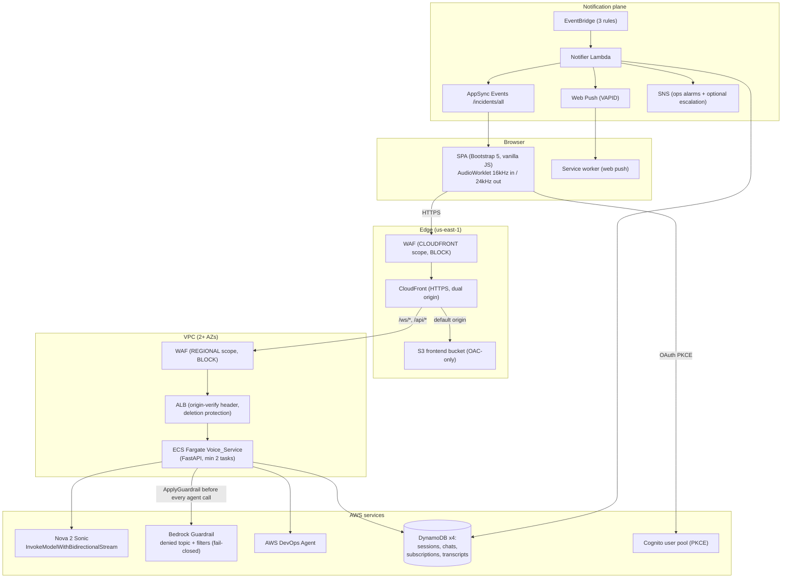

# Nova Sonic Support Portal

A voice-driven AWS support portal for DevOps engineers. An engineer speaks into the browser; Amazon Nova 2 Sonic (Bedrock speech-to-speech, us-east-1) transcribes and converses over a bidirectional stream, forwarding diagnostic questions as text to the AWS DevOps Agent through a Nova Sonic tool named `ask_devops_agent`. Every tool call is gated **fail-closed** (any error counts as a block) by a deterministic mutation-verb check followed by an Amazon Bedrock Guardrail with a denied topic and content filters: only requests classified as read/diagnostic operations ever reach the agent. The agent then reads the account through a read-only IAM role that you associate with the Agent Space. The agent's streamed answer is spoken back to the engineer.

The portal also pushes incident notifications: EventBridge events (CloudWatch Alarms, Incident Manager, DevOps Agent findings) drive a Notifier Lambda that fans out to an AppSync Events channel (in-app popup + chime) and to Web Push subscriptions (browser closed), with optional SNS escalation. Voice sessions survive Bedrock's 8-minute stream cap through session segmentation with context replay, and survive disconnects through reconnect with transcript restore from DynamoDB.


# Contributors

T.V.R.L.Phani Kumar Dadi and Anand Krishna Varanasi

## Architecture



| Component | AWS resources | Purpose |
|---|---|---|
| Frontend | CloudFront + S3 (OAC-only bucket) | Serves the SPA; dual origin routes `/ws/*` and `/api/*` to the ALB |
| Edge protection | WAF web ACLs (CLOUDFRONT + REGIONAL scopes) | AWSManagedRulesCommonRuleSet + KnownBadInputsRuleSet in block mode, with logging |
| Voice ingress | ALB (HTTP listener) | Forwards only requests carrying the CloudFront-injected `x-origin-verify` secret; deletion protection on |
| Voice_Service | ECS Fargate (min 2 tasks, 2+ AZs) | WebSocket endpoint, Bedrock streaming, segmentation, tool routing, task scale-in protection |
| Speech model | Bedrock Nova 2 Sonic | `InvokeModelWithBidirectionalStream` over HTTP/2 in us-east-1 |
| Guardrail | Mutation-verb check + Bedrock Guardrail (denied topic, content filters) | Fail-closed gate evaluated via `ApplyGuardrail` before every DevOps Agent call |
| Diagnostics | AWS DevOps Agent (`aidevops:CreateChat` / `SendMessage`) | Answers engineer questions; one chat per voice session, optionally executionId-scoped |
| Session store | DynamoDB: `{env}-voice-sessions` (GSI `by-engineer`), `{env}-agent-chats`, `{env}-push-subscriptions`, `{env}-transcripts` | Session state, chat mappings, push subscriptions, transcripts; TTL + SSE + PITR |
| In-app notifications | AppSync Events API (channel `/incidents/all`) | Cognito-authorized realtime subscription; IAM publish from the Notifier |
| Notifier | Lambda (Python 3.14, async) | Normalizes EventBridge events, fans out to AppSync + Web Push + optional SNS |
| Event sources | EventBridge rules | CloudWatch Alarms, Incident Manager, DevOps Agent findings |
| Auth | Cognito user pool + hosted UI | OAuth 2.0 code + PKCE; JWT validated at the WebSocket handshake and on AppSync connects |
| Observability | 4 CloudWatch alarms + ops SNS topic | Task count, unhealthy targets, voice 5XX rate, Notifier errors |

### Repository layout

```
backend/
  voice_service/       Voice_Service: FastAPI + websockets on ECS Fargate (ports/adapters)
  notifier/            Notifier Lambda (EventBridge -> AppSync Events + Web Push + SNS)
  shared/              Shared primitives: exceptions, structured logging, bounded retry
frontend/
  public/              Static shell (index.html, sw.js); config.json is generated at deploy
  src/                 ES modules: auth, audio worklets, WS client, events, push, UI
  tests/               vitest + fast-check suites
infrastructure/
  bootstrap/           Layer 1: 3 pipelines, source buckets, ECR, artifact store, app state backend, optional VAPID key
  app/                 Layer 2: VPC, ALB, ECS, Cognito, DynamoDB, AppSync, Guardrail, WAF,
                       CloudFront+S3, EventBridge, Notifier Lambda, alarms
  tests/               Terraform plan-assertion + negative-validation suites (pytest)
ci/
  frontend|backend|iac/  Per-pipeline buildspecs: scan.yml, test.yml, build.yml, deploy.yml
scripts/
  deploy.sh            Idempotent end-to-end orchestrator (all + per-target subcommands)
  push-source.sh       Pipeline trigger helper (archive -> S3 upload)
  smoke/               Post-deploy smoke checks (run-all.sh + checks 01-05)
```

Each pipeline runs **Source → SecurityScan → UnitTest → BuildAndPlan → ManualApproval (7-day timeout) → Deploy**; every stage is gated on the previous one and all deploy work runs inside CodeBuild (no CodePipeline S3 deploy action). Buildspecs travel inside the source archive under `ci/`.

## Prerequisites

| Requirement | Notes |
|---|---|
| AWS account in **us-east-1** that can invoke Amazon Nova 2 Sonic | `amazon.nova-2-sonic-v1:0`. Amazon Bedrock serverless models are available by default; make sure no IAM policy or SCP denies it (step 0b). The reference implementation deploys in us-east-1 because the CloudFront-scope AWS WAF web ACL must live there |
| An AWS DevOps Agent Agent Space | You need its **space id** (`devops_agent_space_id` variable). See [Creating an Agent Space](https://docs.aws.amazon.com/devopsagent/latest/userguide/getting-started-with-aws-devops-agent-creating-an-agent-space.html) |
| Pre-existing S3 access-logging bucket | Receives ALB access logs. The stack only references it (`access_logging_bucket_name`) and **never creates it** |
| Terraform >= 1.9 | Pipelines pin 1.9.8 |
| AWS CLI v2 | Credentials able to apply the bootstrap layer and upload source archives |
| Docker | Only needed if building the voice-service image locally; the backend pipeline builds in CodeBuild |
| Node.js 24 | Frontend tooling (`frontend/package.json` engines) |
| Python 3.14 + [uv](https://docs.astral.sh/uv/) | Backend tooling and infrastructure test suites |
| jq, zip, git | Used by `scripts/push-source.sh` and the smoke tests |

### VAPID key pair (Web Push)

The Notifier signs Web Push messages with a VAPID (RFC 8292) ECDSA P-256 key pair. The **private key** is stored as an SSM SecureString and referenced by name only (`vapid_private_key_parameter_name`), so it never appears in source or Terraform state. The **public key** (`vapid_public_key`) is not sensitive and is published to browsers via `config.json`. The key must exist **before the first app-layer deploy**, and, critically, **must never be regenerated once browsers have subscribed**: a new key pair invalidates every existing push subscription. All three options below are therefore strictly *create-if-absent*.

**Option A, Terraform-native (recommended).** The bootstrap layer's `vapid` module generates the pair if absent, stores the private key as an SSM SecureString, and exports the public key. It all runs inside `terraform apply`, with no key material in Terraform state (an `external` data source returns only the public key). Enable it with `create_vapid_key=true`, or via the orchestrator:

```bash
scripts/deploy.sh bootstrap --project <project> --environment <env> \
  --with-vapid --vapid-subject "mailto:ops@example.com"
```

It prints the two values to copy into your app tfvars:

```hcl
vapid_private_key_parameter_name = "/<env>/notifier/vapid-private-key"
vapid_public_key                 = "<printed public key>"
```

Or apply the bootstrap layer directly with the module enabled, then read the outputs:

```bash
cd infrastructure/bootstrap
terraform apply \
  -var "project_name=<project>" -var "environment=<env>" -var "aws_region=us-east-1" \
  -var "create_vapid_key=true" -var 'vapid_subject=mailto:ops@example.com'
terraform output -raw vapid_public_key
terraform output -raw vapid_private_key_parameter_name
```

**Option B, standalone subcommand (key managed outside Terraform).** `scripts/deploy.sh vapid` generates the pair (if absent) with `openssl`, stores the private key as a SecureString, and prints the public key, without touching Terraform state at all:

```bash
scripts/deploy.sh vapid --project <project> --environment <env> \
  --vapid-subject "mailto:ops@example.com"
```

**Option C: fully manual.** Generate and store the key yourself:

```bash
npx web-push generate-vapid-keys
aws ssm put-parameter \
  --region us-east-1 \
  --name "/<env>/notifier/vapid-private-key" \
  --type SecureString \
  --value "<vapid-private-key>"
```

With every option, the parameter **name** goes into the tfvars (`vapid_private_key_parameter_name`) and the **public key** into `vapid_public_key`; the private key material never appears in source or Terraform state.

## Deployment

Deployment order: bootstrap layer (local `terraform apply`) → IaC pipeline (applies the app layer) → backend pipeline (image → ECR → ECS) → bootstrap re-apply (two-phase frontend wiring) → frontend pipeline (sync → invalidation) → smoke tests.

### Quick Start: `scripts/deploy.sh`

`scripts/deploy.sh` orchestrates the entire flow below (or any single stage) from one entry point. It is a thin, **idempotent** wrapper over the tooling this repo already ships: `terraform` for the bootstrap layer, `scripts/push-source.sh` to trigger pipelines, `aws codepipeline` to poll runs and clear the manual-approval gate, and `scripts/smoke/run-all.sh` for the post-deploy checks. It performs no destructive operations.

The portal is **pipeline-driven**: only the bootstrap layer is applied locally; the app layer, container image, and frontend bundle are each deployed by their CodePipeline through the `Source → SecurityScan → UnitTest → BuildAndPlan → ManualApproval → Deploy` stages. For each pipeline the script pushes source, waits for the run to reach `ManualApproval`, and then either pauses for you to approve after reviewing the `BuildAndPlan` output in the console, or approves automatically with `--auto-approve`.

Prerequisites: everything in the [Prerequisites](#prerequisites) table, plus a committed `infrastructure/app/envs/<env>.tfvars` (the [Step 2](#step-2--prepare-the-app-layer-tfvars) contract) and the [VAPID key](#vapid-key-pair-web-push) in place before `infra` (create it with `bootstrap --with-vapid`, the `vapid` subcommand, or manually).

```bash
# Whole flow end to end (pauses at each manual-approval gate for review):
scripts/deploy.sh all --project <project> --environment <env> --region us-east-1

# Non-interactive: approve each gate automatically after BuildAndPlan succeeds
scripts/deploy.sh all --project <project> --environment <env> --auto-approve

# The project/environment/region can also come from the environment:
PROJECT=<project> ENVIRONMENT=<env> AWS_REGION=us-east-1 scripts/deploy.sh all
```

Per-target subcommands: run any stage in isolation (each maps to the numbered steps below):

| Command | Does | Step |
|---|---|---|
| `bootstrap` | Apply the bootstrap layer locally (`terraform apply`); add `--with-vapid` to also generate/store the VAPID key | 1 |
| `vapid` | Standalone generate-if-absent of the VAPID key pair (outside Terraform) | 1 (alt) |
| `infra` | Push the iac source; drive the IaC pipeline that applies the app layer | 2–3 |
| `backend` | Push the backend source; drive the backend pipeline (image → ECR → ECS) | 4 |
| `wire-frontend` | Re-apply bootstrap with the app layer's frontend bucket + CloudFront id | 5 |
| `frontend` | Push the frontend source; drive the frontend pipeline (sync → invalidation) | 6 |
| `create-user` | Create a Cognito engineer account (guarded; skips if it exists) | 6 note |
| `smoke` | Run the read-only post-deploy smoke checks | 7 |
| `outputs` | Fetch and print the app layer's exported Terraform outputs | None |

```bash
scripts/deploy.sh backend --project <project> --environment <env>
scripts/deploy.sh create-user --project <project> --environment <env> --username <engineer@example.com>
scripts/deploy.sh smoke --project <project> --environment <env>
```

Useful options: `--auto-approve` (clear approval gates unattended), `--no-wait` (push source and return without polling: single stages only, not `all`), `--timeout <seconds>` (per-pipeline wait, default 3600), `--username`/`--temp-password` (for `create-user`; the password is read without echo when omitted), `--outputs-json <file>` (reuse a saved outputs capture for `smoke`). Run `scripts/deploy.sh --help` for the full reference.

**Idempotency.** Re-running the whole script, or any subcommand, converges on the same deployed state and never creates duplicate or orphaned resources: `bootstrap`/`wire-frontend` reconcile against Terraform state (a no-op when nothing drifts); `infra`/`backend`/`frontend` re-push source, and Terraform state, ECS task-definition comparison, and `aws s3 sync --delete` keep re-runs convergent; `create-user` is guarded by an existence check and never overwrites a password. After a `backend` deploy, keep `container_image` in `envs/<env>.tfvars` in step with the deployed image URI (the [Step 2](#step-2--prepare-the-app-layer-tfvars) catch-up contract) so the next `infra` run does not roll the service back.

The manual walkthrough below documents exactly what each subcommand does under the hood: read it to understand the contracts, or when driving a stage by hand.

### Operator runbook: follow these steps in order

This is the complete, copy-paste sequence for a **first-time deployment**. Do the steps in order; each says exactly what to run and how to obtain every value. Replace `<project>`, `<env>` (for example `dev`), and the placeholders as you go. Everything runs from the repository root unless stated otherwise, and the region is `us-east-1` throughout (the design is pinned to it).

Set these once so every command below can be pasted verbatim:

```bash
export PROJECT=<project>
export ENVIRONMENT=<env>
export AWS_REGION=us-east-1
```

#### 0. One-time account prerequisites (not done by `deploy.sh`)

These live outside the repo. `deploy.sh` checks your credentials but cannot provision an AWS account's entitlements for you.

**0a. AWS credentials**: confirm you are authenticated to the target account:

```bash
aws sts get-caller-identity
```

**0b. Confirm you can invoke Amazon Nova 2 Sonic** (one-time, per account/Region). Amazon Bedrock now gives accounts access to serverless models by default; the old Model access page is retired ([Simplified model access in Amazon Bedrock](https://aws.amazon.com/blogs/security/simplified-amazon-bedrock-model-access/)). You only need to make sure that no IAM policy or service control policy denies the model. Verify the model is offered in the Region:

```bash
aws bedrock list-foundation-models --region us-east-1 \
  --query "modelSummaries[?modelId=='amazon.nova-2-sonic-v1:0'].modelId" --output text
# prints amazon.nova-2-sonic-v1:0
```

**0c. Obtain the DevOps Agent space id.** Create an Agent Space if you do not have one ([Creating an Agent Space](https://docs.aws.amazon.com/devopsagent/latest/userguide/getting-started-with-aws-devops-agent-creating-an-agent-space.html)), then list your spaces with the AWS CLI (version 2.36 or later includes the `devops-agent` commands):

```bash
aws devops-agent list-agent-spaces --region us-east-1 --output table
export DEVOPS_AGENT_SPACE_ID=<agent-space-id>   # from the output above
```

**0d. Ensure an S3 access-logging bucket exists** (the stack references it, never creates it). Reuse an existing one, or create a compliant bucket:

```bash
export LOG_BUCKET="${PROJECT}-${ENVIRONMENT}-alb-access-logs-$(aws sts get-caller-identity --query Account --output text)"
aws s3api create-bucket --bucket "$LOG_BUCKET" --region us-east-1
# Enforce TLS-only access (matches this stack's security posture):
aws s3api put-bucket-policy --bucket "$LOG_BUCKET" --policy "{
  \"Version\": \"2012-10-17\",
  \"Statement\": [{
    \"Sid\": \"DenyInsecureTransport\",
    \"Effect\": \"Deny\", \"Principal\": \"*\", \"Action\": \"s3:*\",
    \"Resource\": [\"arn:aws:s3:::$LOG_BUCKET\", \"arn:aws:s3:::$LOG_BUCKET/*\"],
    \"Condition\": { \"Bool\": { \"aws:SecureTransport\": \"false\" } }
  }]
}"
```

> The ELB access-log delivery permission is region-specific; if you create a fresh bucket, also grant the regional ELB log-delivery principal `s3:PutObject` on `arn:aws:s3:::$LOG_BUCKET/*`. See the [ALB access logging docs](https://docs.aws.amazon.com/elasticloadbalancing/latest/application/enable-access-logging.html). Reusing your org's standard logging bucket avoids this.

#### 1. Bootstrap the CI/CD foundation and generate the VAPID key

One command creates the pipelines/buckets/ECR/state backend **and** generates+stores the VAPID key (private key → SSM SecureString; only the public key leaves Terraform):

```bash
scripts/deploy.sh bootstrap --with-vapid --vapid-subject "mailto:ops@example.com"
```

When it finishes it prints the two VAPID values you need next. You can re-read them (plus the ECR URL for the placeholder tag) any time:

```bash
cd infrastructure/bootstrap
ECR_URL=$(terraform output -raw ecr_repository_url)
VAPID_PARAM=$(terraform output -raw vapid_private_key_parameter_name)
VAPID_PUB=$(terraform output -raw vapid_public_key)
cd -
echo "ECR_URL=$ECR_URL"; echo "VAPID_PARAM=$VAPID_PARAM"; echo "VAPID_PUB=$VAPID_PUB"
```

#### 2. Write and commit the app-layer tfvars

`deploy.sh` cannot do this for you: the IaC pipeline reads a **committed** `infrastructure/app/envs/<env>.tfvars` from the git tree, and two of its values only become known here. Create the file with the values gathered above:

```bash
cat > infrastructure/app/envs/${ENVIRONMENT}.tfvars <<EOF
environment                      = "${ENVIRONMENT}"
access_logging_bucket_name       = "${LOG_BUCKET}"
container_image                  = "${ECR_URL}:bootstrap-placeholder"
devops_agent_space_id            = "${DEVOPS_AGENT_SPACE_ID}"
cognito_domain_prefix            = "${PROJECT}-${ENVIRONMENT}-login"   # must be globally unique in the region
vapid_subject                    = "mailto:ops@example.com"
vapid_private_key_parameter_name = "${VAPID_PARAM}"
vapid_public_key                 = "${VAPID_PUB}"
EOF
cat infrastructure/app/envs/${ENVIRONMENT}.tfvars   # review it

git add infrastructure/app/envs/${ENVIRONMENT}.tfvars
git commit -m "chore: add ${ENVIRONMENT} app-layer tfvars"
```

> `cognito_domain_prefix` must be globally unique within the region; if the app apply later fails claiming the domain is taken, pick another prefix, re-commit, and re-run step 3.

#### 3. Deploy the app layer (IaC pipeline)

```bash
scripts/deploy.sh infra --project "$PROJECT" --environment "$ENVIRONMENT"
```

The script pushes the source, waits for the pipeline, and pauses at the **ManualApproval** gate: review the `BuildAndPlan` output in the CodePipeline console, then answer the prompt to approve. Add `--auto-approve` to skip the prompt and approve automatically once `BuildAndPlan` succeeds. (The ECS service will show 0 running tasks until step 4, which is expected.)

#### 3b. Associate this account with the Agent Space (required)

Terraform creates the read-only role the agent assumes (`<env>-devops-agent-readonly`), but the AWS provider has no DevOps Agent resources, so it cannot tell the Agent Space to use it. **Until you do this, the agent cannot see any resource in this account**, and it answers questions about another associated account or with empty results, without an error.

Get the role ARN:

```bash
AGENT_ROLE_ARN=$(scripts/deploy.sh outputs --project "$PROJECT" --environment "$ENVIRONMENT" \
  | jq -r '.devops_agent_assumable_role_arn.value')
ACCOUNT_ID=$(aws sts get-caller-identity --query Account --output text)
echo "$AGENT_ROLE_ARN"
```

The role's trust policy allows `aidevops.amazonaws.com` only with `aws:SourceAccount` equal to this account, so the Agent Space must be in the same account as the deployment.

**Console:** open the AWS DevOps Agent console, select your Agent Space, choose the **Capabilities** tab, and in the **Cloud** section add this account (as the primary source if the space has none, otherwise under **Secondary sources**). Choose to use an existing role and enter `$AGENT_ROLE_ARN`. See [Connecting multiple AWS accounts](https://docs.aws.amazon.com/devopsagent/latest/userguide/configuring-integrations-and-knowledge-connecting-multiple-aws-accounts.html).

**CLI** (adds the account as a secondary source):

```bash
aws devops-agent associate-service --region us-east-1 \
  --agent-space-id "$DEVOPS_AGENT_SPACE_ID" --service-id aws \
  --configuration "{\"aws\":{\"accountId\":\"$ACCOUNT_ID\",\"accountType\":\"monitor\",\"assumableRoleArn\":\"$AGENT_ROLE_ARN\"}}"
```

Do **not** configure the optional elevated role (`agentElevatedRoleArn`). It is the write-capable role for agent actions, and this portal is read-only by design. If the console wizard created an elevated role or its own broader role for another account, remove that association or its elevated role.

Verify:

```bash
aws devops-agent list-associations --region us-east-1 --agent-space-id "$DEVOPS_AGENT_SPACE_ID" \
  --query 'associations[].configuration'
```

Your account ID should appear with `assumableRoleArn` set to `$AGENT_ROLE_ARN` and no `agentElevatedRoleArn`. After you ask the portal a question, `aws iam get-role --role-name "${ENVIRONMENT}-devops-agent-readonly" --query Role.RoleLastUsed` shows a timestamp.

#### 4. Build and deploy the backend image, then re-pin the image tag

```bash
scripts/deploy.sh backend --project "$PROJECT" --environment "$ENVIRONMENT"
```

After it reports the service stable, capture the deployed image URI and commit it into the tfvars so the next `infra` run does not roll ECS back to the placeholder:

```bash
IMAGE_URI=$(aws ecs describe-task-definition \
  --task-definition "${ENVIRONMENT}-voice-service" --region us-east-1 \
  --query 'taskDefinition.containerDefinitions[0].image' --output text)
echo "$IMAGE_URI"

sed -i.bak "s#^container_image .*#container_image                  = \"${IMAGE_URI}\"#" \
  infrastructure/app/envs/${ENVIRONMENT}.tfvars && rm -f infrastructure/app/envs/${ENVIRONMENT}.tfvars.bak
git add infrastructure/app/envs/${ENVIRONMENT}.tfvars
git commit -m "chore: pin ${ENVIRONMENT} container_image to deployed image"
```

#### 5. Wire the frontend targets (two-phase) and deploy the frontend

```bash
scripts/deploy.sh wire-frontend --project "$PROJECT" --environment "$ENVIRONMENT"
scripts/deploy.sh frontend      --project "$PROJECT" --environment "$ENVIRONMENT"
```

`wire-frontend` re-applies bootstrap with the app layer's frontend bucket + CloudFront id (read automatically from the exported outputs); `frontend` drives the frontend pipeline (again pausing at the approval gate unless `--auto-approve`).

#### 6. Create your first engineer account

Enrollment is admin-create only:

```bash
scripts/deploy.sh create-user --project "$PROJECT" --environment "$ENVIRONMENT" \
  --username you@example.com
# prompts for a temporary password (12+ chars, all four character classes), read without echo
```

#### 7. Smoke-test the deployment

```bash
scripts/deploy.sh smoke --project "$PROJECT" --environment "$ENVIRONMENT"
```

Run the gate evaluation set (51 labelled read and change prompts) against the deployed guardrail. See [evaluation/README.md](evaluation/README.md) for the command and the reference results.

Print the portal URL to open it:

```bash
scripts/deploy.sh outputs --project "$PROJECT" --environment "$ENVIRONMENT" | jq -r '.portal_url.value'
```

#### After the first deploy: steady state is one command

Once `envs/<env>.tfvars` carries real values (VAPID + the deployed `container_image`), the whole flow is idempotent and hands-off. To ship subsequent changes or re-converge everything:

```bash
scripts/deploy.sh all --project "$PROJECT" --environment "$ENVIRONMENT" --auto-approve
```

Or run just the stage you changed: `infra`, `backend`, or `frontend`. Re-running any stage (or `all`) never creates duplicate or orphaned resources.

**What still needs a human, and why:** confirming Bedrock model availability and providing the access-logging bucket (account entitlements, step 0); associating the account with the Agent Space (step 3b, no Terraform resource exists); committing `envs/<env>.tfvars` (the IaC pipeline reads the committed git tree, and the VAPID public key + image digest are only known after earlier stages); approving each pipeline's ManualApproval gate (omit with `--auto-approve`); and re-pinning `container_image` after a backend deploy (step 4). Everything else is automated by `deploy.sh`.


### Step 1: Apply the bootstrap layer

```bash
cd infrastructure/bootstrap
terraform init
terraform apply \
  -var "project_name=<project>" \
  -var "environment=<env>" \
  -var "aws_region=us-east-1"
```

The bootstrap layer keeps its own local state (it creates the remote backend the app layer uses). Keep `<project>-<env>` short: the derived pipeline name `<project>-<env>-frontend` must stay within 39 characters.

To also generate and store the VAPID key in the same apply, add `-var "create_vapid_key=true" -var 'vapid_subject=mailto:ops@example.com'` (see the [VAPID key](#vapid-key-pair-web-push) section) and copy the `vapid_public_key` / `vapid_private_key_parameter_name` outputs into the app tfvars.

**Success looks like:** `Apply complete` followed by the outputs `source_bucket_names` (frontend/backend/iac), `pipeline_names`, `ecr_repository_url`, `artifact_bucket_name`, `state_bucket_name`, `lock_table_name`, and `source_object_key` (`source.zip`), plus `vapid_public_key` and `vapid_private_key_parameter_name` when `create_vapid_key=true`. The three pipelines exist in the CodePipeline console (their first automatic run fails at Source until a source archive is uploaded, which is expected).

### Step 2: Prepare the app-layer tfvars

The IaC pipeline plans `infrastructure/app` using exactly one variable file committed at `infrastructure/app/envs/<env>.tfvars` inside the iac source archive (contract in `ci/iac/build.yml`; the stage fails if several `envs/*.tfvars` are present). Create it with every required app variable:

```hcl
# infrastructure/app/envs/<env>.tfvars: non-secret values only
environment                      = "<env>"
access_logging_bucket_name       = "<pre-existing-logs-bucket>"
container_image                  = "<ecr_repository_url>:bootstrap-placeholder"
devops_agent_space_id            = "<agent-space-id>"
cognito_domain_prefix            = "<globally-unique-prefix>"
vapid_subject                    = "mailto:<ops@example.com>"
vapid_private_key_parameter_name = "/<env>/notifier/vapid-private-key"
vapid_public_key                 = "<vapid-public-key>"
```

Notes on the contract (see `ci/iac/build.yml` and `ci/backend/deploy.yml`):

- `lambda_zip_path` is **always injected by the pipeline** (it packages the Notifier zip itself); a tfvars value for it is overridden.
- `container_image`: Terraform owns the ECS task definition, and the ECR repository is immutable-tagged. On the first apply no image exists yet, so use a placeholder tag. The apply succeeds, but voice tasks cannot start until Step 4 deploys a real image. After every backend-pipeline deploy, update this value to the image URI the pipeline deployed (printed in its Deploy logs), otherwise the **next** IaC apply rolls the service back to the stale tfvars image.
- Optional tuning variables (scaling thresholds, retention days, `create_escalation_topic`, `alarm_email_subscriptions`, ...) are documented in `infrastructure/app/variables.tf`.

### Step 3: Push the iac source (applies the app layer)

`scripts/push-source.sh` archives the repository (committed tree via `git archive HEAD` in a git work tree (commit the tfvars first), or a filtered `zip` of the working tree otherwise) and uploads it as `source.zip`, which auto-starts the matching pipeline:

```bash
scripts/push-source.sh iac <iac-source-bucket>
```

The pipeline runs Source → SecurityScan (gitleaks, checkov, hardcoded-value grep gate) → UnitTest (`terraform fmt -check`, `validate` on both layers, plan-assertion suite) → BuildAndPlan (`terraform plan -out=tfplan`). Review the plan in the BuildAndPlan logs, then **approve the ManualApproval stage in the CodePipeline console**. The Deploy stage applies the exact reviewed plan.

**Success looks like:** the Deploy stage log ends with `App layer applied; outputs exported to s3://<state-bucket>/app-outputs/latest.json`, and that object exists. The ECS service exists but shows 0 running tasks (placeholder image): expected until Step 4.

### Step 4: Push the backend source (image → ECR → ECS)

```bash
scripts/push-source.sh backend <backend-source-bucket>
```

After scan (gitleaks, bandit, pip-audit) and unit-test gates (ruff, mypy --strict, interrogate, import-linter, pytest for both packages), BuildAndPlan builds the container from `backend/` and pushes it to ECR under an immutable `<source-version>-b<build-number>` tag. Approve, then Deploy registers a new task-definition revision pointing at that image and updates the service.

**Success looks like:** `aws ecs wait services-stable` inside the Deploy stage succeeds and the log ends with `Service <env>-voice-service is stable on <image-uri>`. Running task count reaches 2. Now copy that image URI into `container_image` in your tfvars (and commit) per the Step 2 catch-up contract.

### Step 5: Re-apply bootstrap with the frontend targets (two-phase)

The frontend pipeline needs the bucket and distribution the app layer just created. Read them from the exported outputs, then re-apply bootstrap:

```bash
aws s3 cp "s3://<state-bucket>/app-outputs/latest.json" - | \
  jq -r '"frontend_bucket_name=\(.frontend_bucket_name.value)\ncloudfront_distribution_id=\(.cloudfront_distribution_id.value)"'

cd infrastructure/bootstrap
terraform apply \
  -var "project_name=<project>" \
  -var "environment=<env>" \
  -var "aws_region=us-east-1" \
  -var "frontend_bucket_name=<frontend_bucket_name>" \
  -var "cloudfront_distribution_id=<cloudfront_distribution_id>"
```

**Success looks like:** `Apply complete` with the frontend pipeline's Deploy CodeBuild project updated in place: its `FRONTEND_BUCKET` and `CLOUDFRONT_DISTRIBUTION_ID` environment variables are now populated (the deploy buildspec fails fast while either is empty).

### Step 6: Push the frontend source

```bash
scripts/push-source.sh frontend <frontend-source-bucket>
```

After scan (gitleaks, `npm audit --audit-level=high`, eslint) and test (`npx vitest --run`) gates, BuildAndPlan assembles the static bundle. Approve, then Deploy generates `config.json` from the exported Terraform outputs, runs `aws s3 sync` to the frontend bucket, and creates a CloudFront invalidation.

**Success looks like:** the Deploy log ends with `Frontend deployed to s3://<frontend-bucket> and invalidation issued for distribution <id>`. The portal is reachable at the `portal_url` output (`https://<cloudfront-domain>`), and the sign-in button redirects to the Cognito hosted UI.

**First-deploy note: create an engineer account.** Enrollment is closed (admin-create only); engineers sign in with their email address. Get the pool id from the exported outputs (`cognito_user_pool_id`) and create a user:

```bash
aws cognito-idp admin-create-user \
  --region us-east-1 \
  --user-pool-id "<cognito_user_pool_id>" \
  --username "<engineer@example.com>" \
  --user-attributes Name=email,Value="<engineer@example.com>" Name=email_verified,Value=true \
  --temporary-password "<TempPassw0rd!123>"
```

The password policy requires 12+ characters with all four character classes; the hosted UI forces a password change on first sign-in. `scripts/deploy.sh create-user --username <engineer@example.com>` wraps this command and skips it idempotently when the account already exists.

### Step 7: Post-deploy smoke tests

Run the read-only smoke checks against the deployed environment using the exported outputs:

```bash
aws s3 cp "s3://<state-bucket>/app-outputs/latest.json" app-outputs.json
scripts/smoke/run-all.sh --outputs-json app-outputs.json
```

Checks: 01 live guardrail blocks canonical destructive utterances, 02 AppSync Events rejects unauthorized connects (export `COGNITO_TOKEN=<jwt>` to also exercise the authorized half), 03 direct-to-ALB requests are rejected, 04 HTTP→HTTPS redirect and direct-S3 403, 05 WAF blocks a known-bad-input probe.

**Success looks like:** the summary line `all 5 checks passed or skipped gracefully` and exit code 0.

## Local development

### Backend (`backend/voice_service`, `backend/notifier`)

Python 3.14 with uv; the same gates the pipeline runs (`ci/backend/test.yml`). From the package directory (`backend/voice_service` shown; for `backend/notifier` replace `app tests ../shared` with `src tests` and skip the extra interrogate line):

```bash
cd backend/voice_service
uv venv --python 3.14 .venv
uv pip install --python .venv/bin/python ".[dev]"

.venv/bin/ruff check app tests ../shared
MYPYPATH=.. .venv/bin/mypy
.venv/bin/interrogate app tests
.venv/bin/interrogate --fail-under=100 ../shared
PYTHONPATH=.. .venv/bin/lint-imports
PYTHONPATH=.. .venv/bin/python -m pytest -q
```

All tests (unit + hypothesis property suites) run against in-memory fakes: no AWS access needed.

### Frontend (`frontend/`)

```bash
cd frontend
npm ci
npx vitest --run
npm run lint
```

### Infrastructure (`infrastructure/`)

```bash
terraform fmt -check -recursive infrastructure
terraform -chdir=infrastructure/bootstrap init -backend=false && terraform -chdir=infrastructure/bootstrap validate
terraform -chdir=infrastructure/app init -backend=false && terraform -chdir=infrastructure/app validate
```

Test suites (pinned in `infrastructure/tests/requirements.txt`):

```bash
uv venv --python 3.14 .venv-iac
uv pip install --python .venv-iac/bin/python -r infrastructure/tests/requirements.txt
.venv-iac/bin/python -m pytest infrastructure/tests -q
```

The plan-assertion suites (`test_bootstrap_plan.py`, `test_app_plan.py`) need AWS credentials and the `terraform` binary (the AWS provider resolves data sources at plan time), and skip with a clear message otherwise; their primary home is the IaC pipeline's test stage. The negative-validation suite (`test_negative_validation.py`) needs no credentials and never touches AWS.

## Known limitations

This is sample code. Before any use beyond a test account, review these defaults (details and fixes in [SECURITY.md](SECURITY.md)):

- **CloudFront to ALB is plain HTTP.** The ALB accepts only requests that carry the CloudFront-injected `x-origin-verify` secret, but the hop itself is unencrypted. Use an HTTPS listener with an ACM certificate, or a CloudFront VPC origin with an internal ALB.
- **Cognito MFA is optional.** Set `mfa_configuration = "ON"` on the user pool for anything beyond a test environment.
- **An agent answer in progress is lost at stream rollover.** Bedrock caps a bidirectional stream at 8 minutes. The audio continues on the next segment, but an AWS DevOps Agent answer that arrives during the rollover is dropped (logged as `session.tool_result_dropped`). Ask the question again.
- **The agent sees only associated accounts.** Answers describe whichever accounts are associated with the Agent Space (step 3b).

## Security posture

- **Fail-closed gate**: a deterministic mutation-verb check runs first, then `ApplyGuardrail` (denied topic and content filters) is evaluated before every DevOps Agent call; any intervention, error, timeout, or malformed response blocks the request and produces an audit log entry. No Automated Reasoning policy is attached: Automated Reasoning checks validate model output, and a plain question submitted as input would not produce a VALID finding.
- **Cognito JWT everywhere**: validated (signature, expiry, issuer, audience) at the WebSocket handshake before accept, and required on AppSync Events connects/subscribes. Unauthenticated connections are rejected before any processing.
- **WAF in block mode at both scopes** (CLOUDFRONT + REGIONAL): CommonRuleSet + KnownBadInputsRuleSet, with WAF logging to persistent log groups.
- **TLS-enforcing bucket policies**: every bucket created by either layer denies `aws:SecureTransport = false` and TLS < 1.2.
- **OAC-only frontend bucket**: read access only for the CloudFront distribution; all other principals denied.
- **ALB hardening**: deletion protection enabled; the listener forwards only requests carrying the CloudFront-injected `x-origin-verify` secret, so direct-to-ALB traffic gets a fixed 403.
- **No hardcoded secrets**: sensitive values live in SSM Parameter Store / Secrets Manager and are referenced by name; gitleaks plus a hardcoded-value grep gate run in every pipeline's scan stage.
- **Least-privilege IAM**: per-component roles; the task role is scoped to the Nova Sonic model, the guardrail, the four tables, `aidevops:CreateChat`/`SendMessage`, and `ecs:UpdateTaskProtection`.

## Operations

**Alarms** (all publish to the ops SNS topic; subscribe via `alarm_email_subscriptions` or externally):

| Alarm | Metric | Fires when |
|---|---|---|
| `<env>-running-task-count` | ECS/ContainerInsights `RunningTaskCount` | Task count falls below `running_task_count_threshold` (default 2) |
| `<env>-alb-unhealthy-targets` | `UnHealthyHostCount` | Any voice target fails ALB health checks |
| `<env>-voice-5xx` | `HTTPCode_Target_5XX_Count` | 5XX sum exceeds `voice_5xx_threshold` (default 10) |
| `<env>-notifier-errors` | Lambda `Errors` | Notifier invocations fail |

**Logs**: voice-service and Notifier structured JSON logs (session-id-scoped) in CloudWatch Logs (`log_retention_days`, default 90); WAF logs for both scopes (`waf_log_retention_days`, default 365); ALB access logs to the operator-provided access-logging bucket.

**Data retention**: voice-session and transcript records carry a DynamoDB TTL of last update + `session_retention_days` (default 30 days). Push subscriptions have no TTL: they are removed on unsubscribe or on push-service 404/410 rejection.

**Origin-verify secret rotation**: the secret is Terraform-generated (`random_password.origin_verify` in `infrastructure/app/main.tf`). To rotate, mark it for replacement against the app layer's remote state, then let the IaC pipeline plan and apply: CloudFront, the ALB rule, and the SSM parameter update together:

```bash
cd infrastructure/app
terraform init \
  -backend-config="bucket=<state-bucket>" \
  -backend-config="key=app/terraform.tfstate" \
  -backend-config="region=us-east-1" \
  -backend-config="dynamodb_table=<lock-table>"
# Records the replacement intent in the remote state; the pipeline's next
# `terraform plan` reads that state and plans the rotation for review.
# (`terraform taint` is the pre-0.15 spelling of the same operation and is
# now deprecated.)
terraform apply -replace=random_password.origin_verify -refresh-only
scripts/push-source.sh iac <iac-source-bucket>   # from the repo root; approve and deploy
```

If you would rather rotate in one local step without the pipeline review, run `terraform apply -replace=random_password.origin_verify` directly against the app layer (no `-refresh-only`), but the reviewed-plan path above keeps the change auditable through the ManualApproval gate.

**Scaling knobs** (`infrastructure/app/variables.tf`): `max_capacity` (default 10), `scale_out_threshold` (default 80) and `scale_in_threshold` (default 20) on ALB `ActiveConnectionCount`. The floor is fixed at 2 tasks across 2+ AZs, and scale-in never terminates a task holding live voice sessions (ECS task scale-in protection).

## Clean up

The deployment creates billable resources, including Fargate tasks, NAT gateways, an ALB, and a CloudFront distribution. Several resources carry deletion protection and several buckets are versioned, so `terraform destroy` fails until you complete the preparation steps. Tear down the app layer first, then the bootstrap layer, because the bootstrap layer holds the app layer's remote state.

Set the variables used below (from the repo root):

```bash
export PROJECT=<project> ENVIRONMENT=<env> AWS_REGION=us-east-1
scripts/deploy.sh outputs --project "$PROJECT" --environment "$ENVIRONMENT" > app-outputs.json
```

**1. Remove the Agent Space association.** Find the association for this account and disassociate it:

```bash
aws devops-agent list-associations --region us-east-1 --agent-space-id "$DEVOPS_AGENT_SPACE_ID" \
  --query 'associations[].[associationId,configuration]'
aws devops-agent disassociate-service --region us-east-1 \
  --agent-space-id "$DEVOPS_AGENT_SPACE_ID" --association-id <association-id>
```

**2. Turn off deletion protection in the app layer.**

```bash
# ALB
ALB_ARN=$(aws elbv2 describe-load-balancers --region us-east-1 --names "${ENVIRONMENT}-voice-alb" \
  --query 'LoadBalancers[0].LoadBalancerArn' --output text)
aws elbv2 modify-load-balancer-attributes --region us-east-1 --load-balancer-arn "$ALB_ARN" \
  --attributes Key=deletion_protection.enabled,Value=false

# The four DynamoDB tables
for t in $(jq -r '.dynamodb_table_names.value[]' app-outputs.json); do
  aws dynamodb update-table --region us-east-1 --table-name "$t" --no-deletion-protection-enabled
done
```

For the Cognito user pool (`cognito_user_pool_id` in `app-outputs.json`), turn off deletion protection in the Amazon Cognito console under **Settings**. Do not use `aws cognito-idp update-user-pool` for this, because that call resets every setting you omit to its default.

**3. Empty the frontend bucket.** Open the bucket named by `frontend_bucket_name` in the Amazon S3 console and choose **Empty**, which removes all object versions.

**4. Destroy the app layer.** Run it locally against the remote state. Read the state bucket and lock table names from the bootstrap layer, and pass any existing zip file as `lambda_zip_path`: Terraform reads its hash while planning the destroy, but nothing is uploaded.

```bash
STATE_BUCKET=$(terraform -chdir=infrastructure/bootstrap output -raw state_bucket_name)
LOCK_TABLE=$(terraform -chdir=infrastructure/bootstrap output -raw lock_table_name)
cd infrastructure/app
terraform init -backend-config="bucket=${STATE_BUCKET}" -backend-config="key=app/terraform.tfstate" \
  -backend-config="region=us-east-1" -backend-config="dynamodb_table=${LOCK_TABLE}"
zip -j "$TMPDIR/notifier-placeholder.zip" ../../README.md
terraform destroy -var-file="envs/${ENVIRONMENT}.tfvars" -var "lambda_zip_path=$TMPDIR/notifier-placeholder.zip"
cd -
```

Deleting the CloudFront distribution and its AWS WAF web ACL can take 15 minutes or more.

**5. Prepare the bootstrap layer.**

- Empty the state, artifact, and three source buckets (`state_bucket_name`, `artifact_bucket_name`, `source_bucket_names` in `terraform -chdir=infrastructure/bootstrap output`) with **Empty** in the Amazon S3 console. They are versioned, and the state bucket still holds the app layer's state history.
- Delete the images in the ECR repository (`ecr_repository_url`) from the Amazon ECR console. The repository does not force-delete images.
- Turn off deletion protection on the lock table:

```bash
aws dynamodb update-table --region us-east-1 --table-name "$LOCK_TABLE" --no-deletion-protection-enabled
```

**6. Destroy the bootstrap layer** with the same variables you applied it with:

```bash
cd infrastructure/bootstrap
terraform destroy -var "project_name=${PROJECT}" -var "environment=${ENVIRONMENT}" -var "aws_region=us-east-1"
cd -
```

**7. Remove what Terraform does not own.**

- The VAPID private key parameter (`/<env>/notifier/vapid-private-key` by default). All three VAPID options create it outside Terraform state: `aws ssm delete-parameter --region us-east-1 --name "/${ENVIRONMENT}/notifier/vapid-private-key"`.
- The ALB access-logging bucket, if you created it in step 0d for this deployment only.
- The Agent Space, if you created it only for this sample.
- The local files `app-outputs.json`, `infrastructure/bootstrap/terraform.tfstate`, and its backup, which contain resource ARNs.

## Further reading

- `infrastructure/bootstrap/variables.tf`, `infrastructure/app/variables.tf`: every input variable with validation rules
- `ci/iac/build.yml`, `ci/backend/deploy.yml`, `ci/frontend/deploy.yml`: the tfvars, image catch-up, and outputs-export contracts
- `scripts/deploy.sh --help`, `scripts/push-source.sh --help` header, and `scripts/smoke/run-all.sh`: operator tooling details
- `.kiro/steering/`: coding conventions for `backend/`, `frontend/`, and `infrastructure/`
